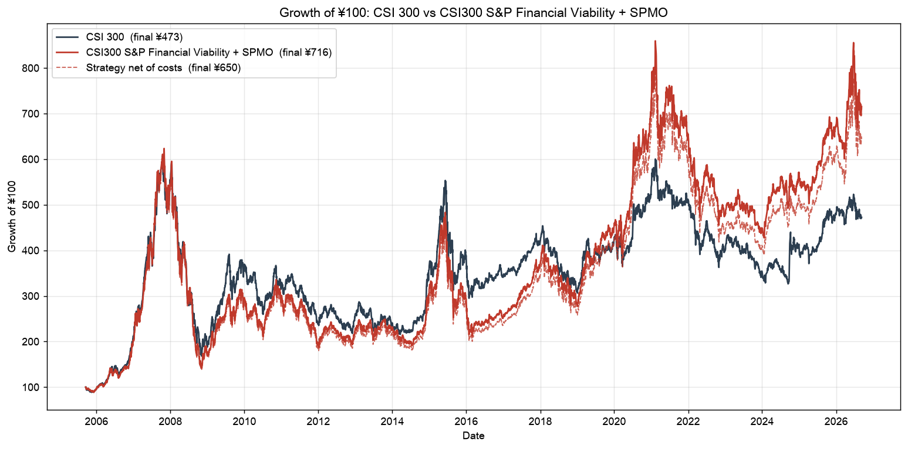
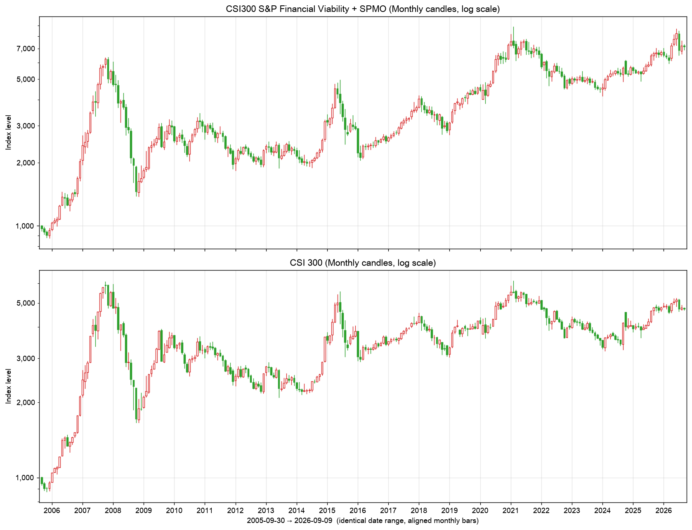

# csi300-spmo-index

**CSI300 S&P Financial Viability + SPMO Momentum Index** — a fully reproducible, point-in-time
backtest of an S&P-style momentum index built on the historical CSI 300 universe, compared with
the traditional CSI 300.

```
Historical CSI300 (point-in-time)
  → S&P Financial Viability (latest quarter > 0 AND trailing 4 quarters > 0, continuing operations)
  → SPMO risk-adjusted momentum (12-1 month price change / daily volatility)
  → Top 20 % by Momentum Score (S&P buffer, parent membership has priority)
  → SPMO weighting (float-adjusted market cap × momentum score, company weight cap)
  → Index (price & total-return, gross & net of costs, daily OHLC)
  → Backtest vs CSI300 (statistics, charts, candlesticks, research report)
```

The model is **fixed**: no parameter is tuned, the 20 % ratio is not optimised and no other factor
(ROE, ROIC, PE, PB, growth, leverage, quality…) is used.

## Results

<!-- AUTO-RESULTS-START -->
*Backtest 2005-09-16 → 2026-09-09 (auto-generated by `python main.py`)*

| Metric       | CSI300         | Strategy       |
|:-------------|:---------------|:---------------|
| Final ¥100   | ¥472.6         | ¥715.6         |
| CAGR         | 7.68%          | 9.83%          |
| Volatility   | 24.69%         | 26.71%         |
| Sharpe       | 0.43           | 0.49           |
| Max Drawdown | -72.30%        | -77.16%        |
| Best Year    | 2007 (+161.5%) | 2007 (+168.5%) |
| Worst Year   | 2008 (-65.9%)  | 2008 (-69.0%)  |





<!-- AUTO-RESULTS-END -->

Full research report: [`output/report/backtest_report.md`](output/report/backtest_report.md)
(executive summary, methodology, data, performance, candlesticks, relative strength, rolling
returns, drawdowns, turnover, costs, market cycles, momentum crashes, and explicit answers to the
17 questions of the specification).

## Quick start

```bash
git clone https://github.com/dongzhaohe321418-lab/csi300-spmo-index.git
cd csi300-spmo-index
python -m venv .venv && source .venv/bin/activate      # Python 3.10+
pip install -r requirements.txt
python main.py                 # one command: data → universe → scores → backtest → charts → report
```

* First run downloads ~950 securities × (prices, statements, dividends, share structure) from the
  free sources below (30–60 min, resumable, everything cached under `data/raw/`). Subsequent runs
  use the cache; `python main.py --update` refreshes the time series, `--skip-download` runs
  fully offline.
* Individual steps: `scripts/download_data.py`, `scripts/calculate_scores.py`,
  `scripts/run_backtest.py`, `scripts/generate_report.py`.
* Tests: `pytest tests`.
* API keys: none are required for the default free sources. An optional Tushare token can be put
  in `.env` (`TUSHARE_TOKEN=…`, see `.env.example`); `.env` is git-ignored and never committed.

## Methodology (as implemented)

### 1. Parent universe — point-in-time CSI 300 membership (`src/universe.py`)
Membership on every trading day since 2005-04-08 is rebuilt from the **official CSIndex
constituent-adjustment announcements** (regular semi-annual reviews, temporary adjustments for
delistings/mergers, and the 2005 full list), fetched from the CSIndex announcement API and parsed
from their HTML tables, Excel and PDF attachments. Starting from the current official list the
program walks backwards through every event; each intermediate list must contain exactly 300
securities and the list reconstructed for 2005-07-01 must equal the official full list published
by CSIndex — otherwise the run aborts. Today's list is never used to infer history other than as
the validated starting point of this backward walk.

Rules enforced by code (`src/backtest.py`, `src/index_engine.py`, `src/audit.py`):
* only members on the reference date are evaluated (`csi300_member = True`); everything else has
  `Eligible = False`, `Selected = False`, `Final Weight = 0`;
* a selected security that leaves the CSI 300 before the implementation date is not implemented;
* a holding removed from the CSI 300 between rebalances leaves the strategy on the same effective
  date (its weight is redistributed pro rata); the engine raises `MembershipError` if any holding
  with positive weight is not a member — no output is produced in that case;
* the buffer can never keep a security that left the parent index.

Data notes: the main announcement of the July-2008 review is mis-filed in the CSIndex archive
(the record repeats a temporary-adjustment notice); its change list is taken from the same-day
companion document *沪深300行业指数样本股调样名单* (union of the sector lists net of sector
reclassifications — the construction reproduces the December-2008 review exactly, where both
documents exist). Announcements that only exist as prose (2006-04 four-company privatisation) or
with a code not yet assigned (美的集团 2013) are transcribed in `MANUAL_FIXES` with comments.
`data/processed/csi300_adjustment_events.csv` lists every add/remove with its effective date and
source; `csi300_reconstruction_audit.csv` shows the 300-count check at every step.

### 2. S&P Financial Viability (`src/financials.py`)
Per the S&P U.S. Indices Methodology: the most recent quarter's GAAP net income from continuing
operations must be positive **and** the sum of the four most recent consecutive quarters must be
positive.

| S&P definition | A-share (CAS) field used | Eastmoney F10 field |
|---|---|---|
| Net income from continuing operations, latest quarter | 持续经营净利润 (single quarter) | `CONTINUED_NETPROFIT` (available from the 2018 statement format) |
| fallback where the line does not exist | 净利润 (total net profit incl. minority interests) | `NETPROFIT` |
| announcement date | 首次公告日 | `NOTICE_DATE` |

Chinese quarterly statements are cumulative, so single quarters are differences of consecutive
YTD figures (Q1 = YTD Q1). A report is usable on reference date *R* only if its first announcement
date ≤ *R*. Eastmoney's `NOTICE_DATE` for periods before 2010 is the date of the *following year's*
report in which the period appears as a comparative (lag ≈ 13 months); such implausible dates
(lag > 200 days) and missing dates are replaced by the statutory filing deadline (Q1 Apr-30,
Q2 Aug-31, Q3 Oct-31, annual Apr-30 of the next year), which is never earlier than the true
publication date. Fewer than four consecutive published quarters ⇒ not eligible. Every score file
records the report period, the announcement date used and the reason for any failure.

### 3. SPMO risk-adjusted momentum (`src/momentum.py`)
* `end = last trading day ≤ R − 1 month`, `start = last trading day ≤ R − 13 months`
  (e.g. R = 2026-08-31 → window 2025-07-31 → 2026-07-31).
* Momentum return = P(end)/P(start) − 1 on prices adjusted for bonus/transfer shares and rights
  issues (ex-dividend, i.e. a *price* return, consistent with the CSI 300 price index).
* Volatility = standard deviation (sample) of the security's daily price returns on the days it
  traded inside `(start, end]`; ≥150 traded days required (S&P rule), otherwise not eligible.
* RAM = momentum return / volatility.

### 4. Z-score and Momentum Score (`src/selection.py`)
Cross-sectional z-score of RAM over {CSI 300 member ∧ financially eligible ∧ momentum eligible},
winsorised at ±3; `Score = 1 + Z` if Z > 0 else `1/(1 − Z)`.

### 5. Selection — top 20 % with the S&P buffer
`Target N = round(0.20 × eligible count)` (280 eligible ⇒ 56). Securities ranked within the top
80 % of N are selected automatically; current constituents ranked within 120 % of N are retained
in rank order until N is reached; remaining slots are filled by rank. Retention requires the
security to still be a CSI 300 member and to pass both screens.

### 6. Weighting (`src/weighting.py`)
`raw_i = FMC_i × Score_i`, normalised. Company cap = min(9 %, 20 × the security's market-cap
weight in the CSI 300); excess weight is redistributed proportionally to uncapped securities until
no cap is breached. The 9 % single-company cap is the S&P 500 Momentum value; the "lower of the cap
and 20× the underlying-index weight" form is the S&P factor-index convention. The S&P/BOVESPA
Momentum methodology uses 3× instead — with only ~55 constituents that constraint is jointly
infeasible at every rebalance (Σ caps < 100 %), so 20× is the default; both numbers are plain
settings in `config.yaml` (`weighting.cap_absolute`, `weighting.cap_multiple_of_parent_weight`).
If caps are ever jointly infeasible the multiple is raised in steps of 1 until feasible — the
multiple actually used and the number of capped securities are recorded for every rebalance in
`output/performance/rebalance_summary.csv`. FMC = close × listed A-shares (see Data), and the
parent weight is computed with the same proxy for all 300 members.

### 7. Rebalancing calendar
Reference dates: last trading day of February and August. Implementation: after the close of the
third Friday of March and September (S&P Momentum Indices schedule). Only information available
on the reference date is used — prices dated ≤ R − 1 month, statements announced ≤ R.

### 8. Index calculation (`src/index_engine.py`)
Both indices start at **1000** on the first implementation date (2005-09-16); the
`Growth of ¥100` series and `index_levels.csv` are the same series rebased to 100.
At each implementation date the strategy holds index shares `n_i = Level × w_i / P_i`; between
rebalances the shares are fixed and `Level_t = Σ n_i P_i,t`. A total-return variant reinvests cash
dividends (compared with CSI 300 Total Return, H00300).

**Strategy OHLC.** Open/High/Low/Close of the strategy are computed from the constituents' own
adjusted Open/High/Low/Close with the *same* index shares:
`Open_t = Σ n_i Open_i,t`, `High_t = Σ n_i High_i,t`, `Low_t = Σ n_i Low_i,t`,
`Close_t = Σ n_i Close_i,t`. Open and Close are exact; because constituent highs/lows are not
simultaneous, the aggregated High slightly overstates and the aggregated Low slightly understates
the true intraday extremes (standard portfolio-OHLC approximation). Suspended securities carry
their last close in all four fields. Volume is left blank — a synthetic index has no meaningful
volume. Weekly/monthly candles: Open = first bar's open, High = max, Low = min, Close = last bar's
close. Moving averages (MA20/50/100/200 on daily closes) are chart overlays only and never enter
selection or weighting.

**Net index.** At each implementation date one-way turnover is charged with the historical
A-share cost regime (`config.yaml`): commission 0.08 %/side before 2013 and 0.03 % after; stamp
duty 0.1 % both sides (2005) → 0.3 % both sides (2007-05-30) → 0.1 % both sides (2008-04-24) →
0.1 % sell only (2008-09-19) → 0.05 % sell only (2023-08-28); transfer fee 0.001 %; slippage
0.10 %/side.

## Data (`src/data.py`)

| Item | Source | Notes |
|---|---|---|
| Historical CSI 300 constituents | CSIndex announcements (`/csindex-home/announcement/...`) | 69 events 2005-2026, parsed from HTML / xls / xlsx / pdf |
| CSI 300 OHLC, total-return index | CSIndex official (`000300`, `H00300`) | 2004-12-31 → today |
| Current constituents & weights | CSIndex (`000300cons.xls`, `000300closeweight.xls`) | used to validate the reconstruction and the FMC proxy |
| Stock daily OHLC, volume, amount, ex-date reference price | Sina Finance `hisdata_klc2` | covers delisted securities; suspension days are absent |
| Quarterly income statements + announcement dates | Eastmoney F10 (`lrbAjaxNew`) | `NOTICE_DATE`, `CONTINUED_NETPROFIT`, `NETPROFIT`, … |
| Dividends / bonus shares, rights issues | Eastmoney (`stock_fhps_detail_em`, `stock_pg_em`) | used for the price/total-return adjustment |
| Share structure (listed A-shares) | Eastmoney F10 股本结构 | float-adjusted market-cap proxy |
| Top-10 shareholders (optional) | Sina 股本股东 (`--sources holders`) | free-float refinement: listed A-shares − non-institutional holders ≥5 %, CSIndex tiers; used only when ≥90 % of securities are covered |

Adjusted prices are built by the project itself from raw prices plus corporate actions
(`src/prices.py`), because the free "后复权" series are not multiplicative total-return series.
Raw downloads live in `data/raw/`, derived tables in `data/processed/`. An optional Tushare
provider can replace the free sources when a token is supplied (`data.provider: tushare`).

## Output layout

```
output/scores/YYYY-MM-DD.csv        every CSI300 member on each reference date: reference_date, ticker, name,
                                    csi300_member, quarter_net_income, four_quarter_net_income, financial_eligible,
                                    momentum_return, volatility, RAM, z_score, momentum_score, rank, selected,
                                    csi300_weight, raw_weight, final_weight (+ report dates, window dates, reasons)
output/holdings/YYYY-MM-DD.csv      constituents in force from each implementation date (Ticker, Name, Momentum
                                    Score, Rank, CSI300 Weight, Raw Weight, Final Weight, cap flags)
output/performance/index_levels.csv Date, CSI300, CSI300_SP_FV_SPMO (+ net and total-return variants), base 100
output/performance/strategy_ohlc.csv / csi300_ohlc.csv (+ _w / _m weekly & monthly), relative_strength.csv,
                   summary.csv, annual_returns.csv, monthly_returns.csv, rolling_*.csv, drawdown_stats.csv,
                   market_cycles.csv, momentum_crashes.csv, turnover.csv, rebalance_summary.csv,
                   eligibility_audit.csv, key_figures.json
output/charts/     growth_of_100(.png/_log.png), strategy_candlestick(.png/_ma.png), csi300_candlestick(.png/_ma.png),
                   candlestick_comparison(.png/_ma/_weekly/_daily), relative_strength, drawdown_comparison,
                   annual_returns, rolling_1y_return, rolling_3y_cagr, rolling_5y_cagr, rolling_excess_return, turnover
output/report/backtest_report.md   the research report
```

## Automatic checks before results are written
For every reference date (`output/performance/eligibility_audit.csv`): all selected securities are
CSI 300 members on the reference date; all pass Financial Viability; every statement used was
announced on/before the reference date; every security has a price 13 months before the reference
date and ≥150 traded days in the window; the momentum window ends before the reference date; final
weights sum to 100 %. The index engine additionally asserts daily that no holding is outside the
parent index. Any violation raises and stops the run.

## Limitations
* Float-adjusted market cap is approximated by listed A-shares × close (CSIndex's free-float
  factors are not available historically); parent and strategy weights are therefore approximate.
  Against the official 2026-08-31 weight file the proxy has correlation 0.65 and an aggregate
  active share of 23 % (`output/performance/weight_proxy_validation.csv`) — it over-weights
  state-controlled large caps. The optional shareholder-based free-float refinement addresses this
  when the (rate-limited) Sina shareholder pages have been downloaded for ≥90 % of securities.
* Announcement dates before 2010 are unreliable in the free source and are replaced by statutory
  deadlines (conservative; see §2).
* Eastmoney's F10 does not serve financial statements for most delisted companies, so those
  securities fail the screen (no data) during their membership — a conservative treatment.
* Statement values are the latest available (possibly restated) figures attached to the *first*
  announcement date.
* Suspended securities are carried at their last price and (notionally) traded at it on rebalance
  dates.

## Research report (中文完整研究报告)

`python scripts/generate_research_report.py --latex` (after `python main.py`) writes
`output/report/research_report_zh.md`, `.docx`, and an arXiv-style `research_report_zh.tex` /
`.pdf` (XeLaTeX via [tectonic](https://tectonic-typesetting.github.io) or `latexmk -xelatex`;
fonts come from TeX Live — TeX Gyre Pagella / Heros and Fandol Song / Hei — so no system fonts are
needed): methodology, data quality, full performance /
risk / cycle analysis, portfolio characteristics (Financial-Viability funnel, concentration,
persistence, sector exposure), a selection-vs-weighting attribution built with the same index
engine, cost analysis, the answers to the 17 questions, and a like-for-like comparison with the
GitHub project [HSI300-Momentum-Strategy](https://github.com/dongzhaohe321418-lab/HSI300-Momentum-Strategy)
(its Top-20 equal-weight quarterly rules re-implemented on this project's point-in-time data, both
for its own 2019–2025 window and for 2005–2026). The analytics live in `src/research.py`
(diagnostic only — the strategy itself is untouched), figures in `src/research_charts.py`, the
Markdown text in `src/research_text.py`, the LaTeX paper in `src/research_latex.py`; the supporting
tables are written to `output/research/`.

## Repository layout
```
main.py  config.yaml  requirements.txt  .env.example
src/    data.py universe.py prices.py financials.py momentum.py selection.py weighting.py
        index_engine.py backtest.py audit.py metrics.py plots.py analysis.py report.py pipeline.py utils.py
        research.py research_charts.py research_text.py research_latex.py research_report.py docx_export.py tushare_provider.py
scripts/ download_data.py calculate_scores.py run_backtest.py generate_report.py generate_research_report.py
data/   raw/ processed/ cache/        output/ scores/ holdings/ performance/ charts/ research/ report/     tests/
```
