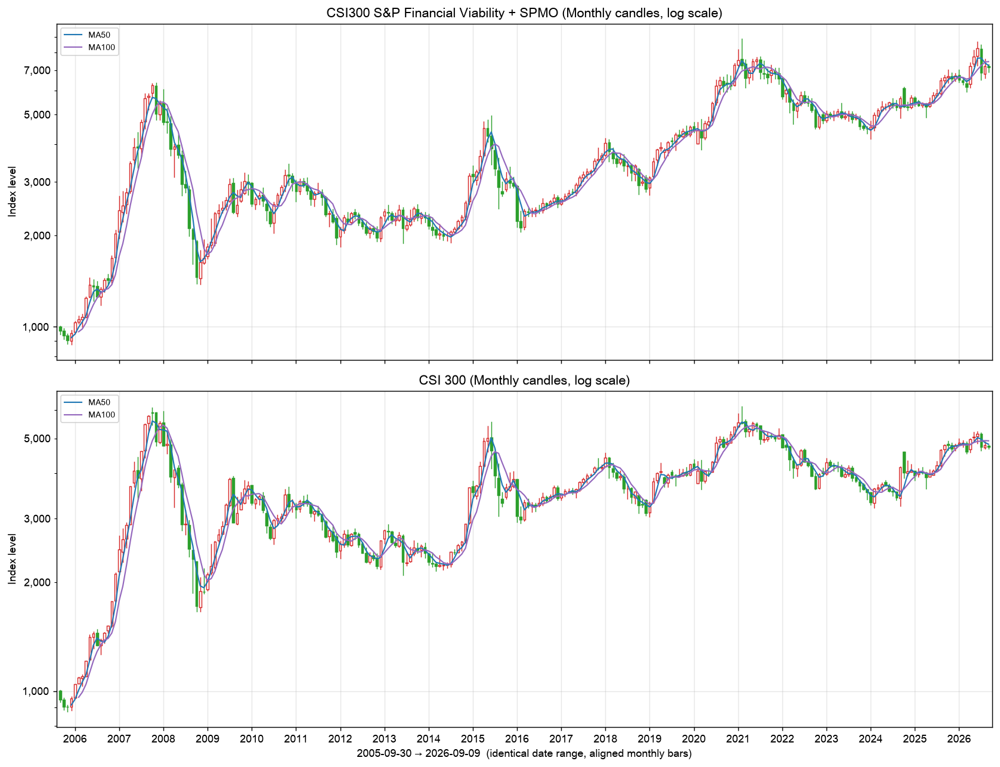
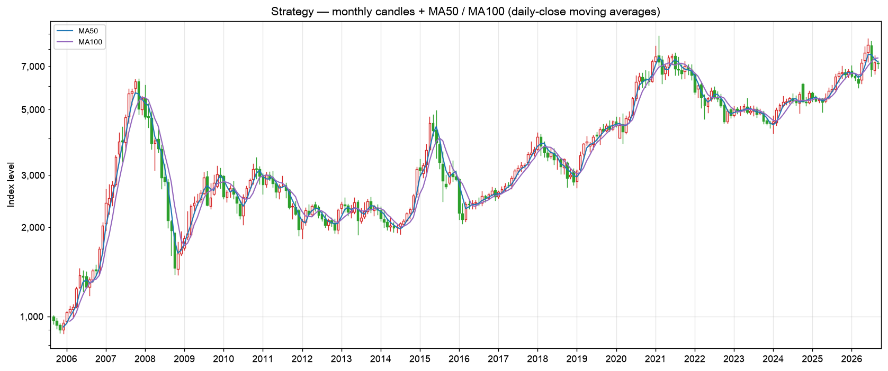
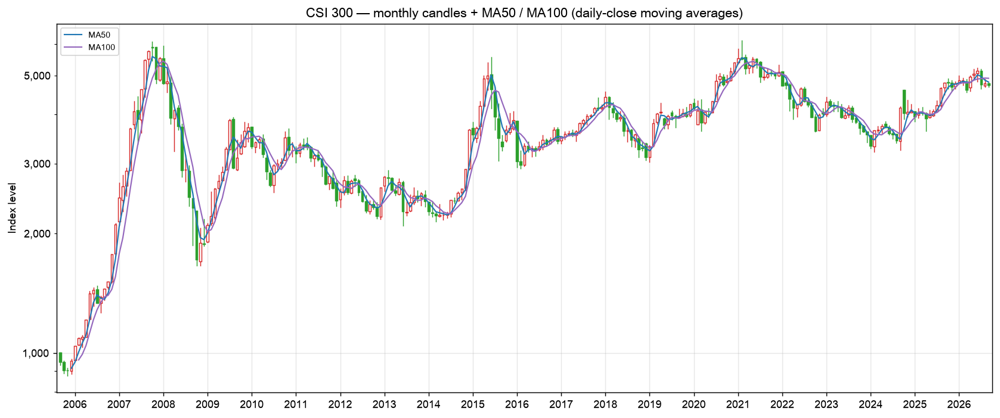
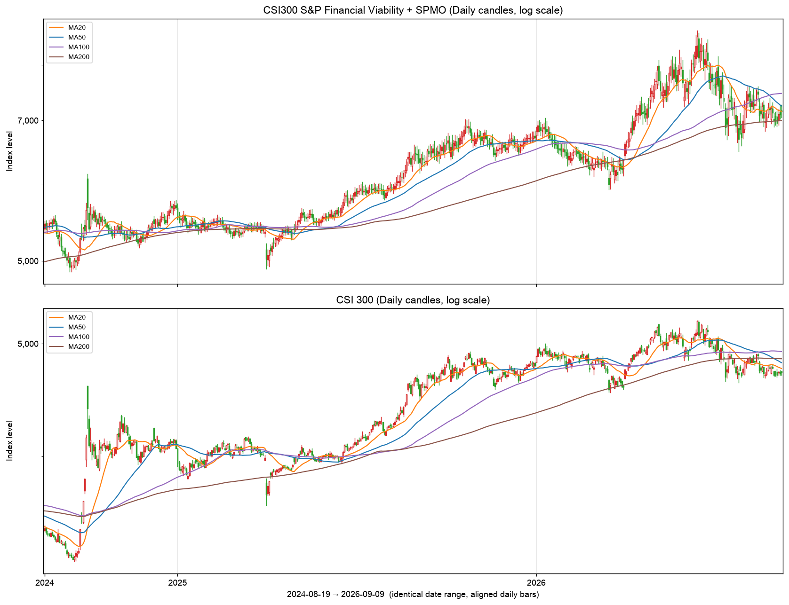
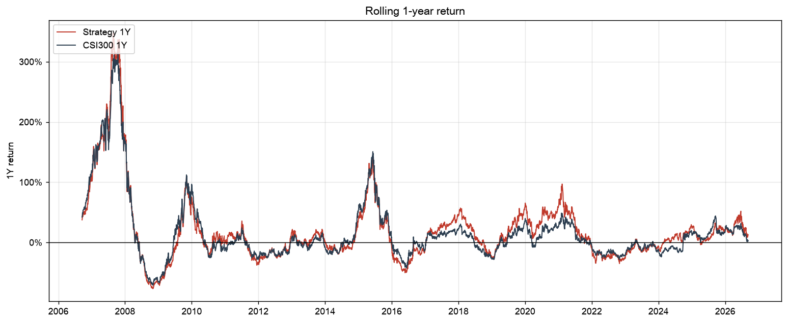
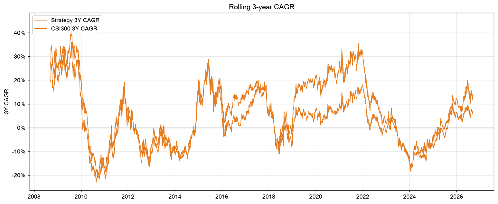
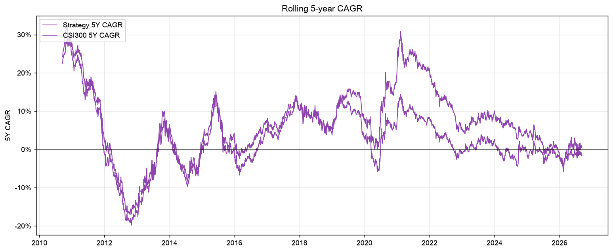
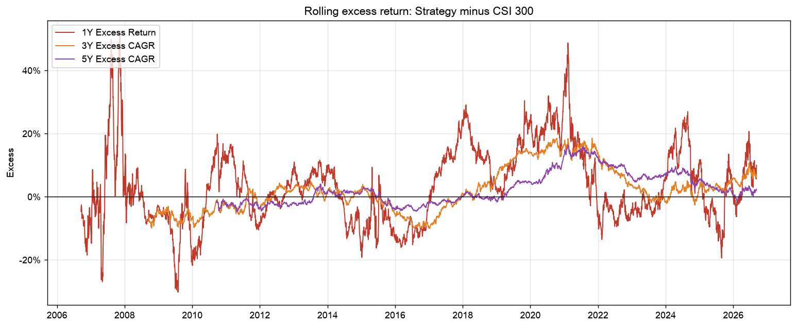

# CSI300 S&P Financial Viability + SPMO Momentum Index — Backtest Report

*Generated 2026-09-10. Backtest 2005-09-16 → 2026-09-09. Both indices start at 1000 on 2005-09-16 (Growth-of-¥100 series rebased to 100).*

## 1. Executive Summary

| Metric       | CSI300         | Strategy       |
|:-------------|:---------------|:---------------|
| Final ¥100   | ¥472.6         | ¥715.6         |
| CAGR         | 7.68%          | 9.83%          |
| Volatility   | 24.69%         | 26.71%         |
| Sharpe       | 0.43           | 0.49           |
| Max Drawdown | -72.30%        | -77.16%        |
| Best Year    | 2007 (+161.5%) | 2007 (+168.5%) |
| Worst Year   | 2008 (-65.9%)  | 2008 (-69.0%)  |

- ¥100 invested in the CSI 300 price index on 2005-09-16 became **¥472.6** by 2026-09-09; the same ¥100 in the strategy became **¥715.6** (gross) / **¥649.8** net of transaction costs.
- CAGR: CSI 300 7.68% vs strategy 9.83% (net 9.33%); annualised excess return 2.15%, tracking error 10.64%, information ratio 0.20.
- Risk: volatility 24.69% vs 26.71%; maximum drawdown -72.30% vs -77.16%; Sharpe 0.43 vs 0.49; beta 0.99, Jensen alpha 2.62% p.a.
- The strategy beat the CSI 300 in 12 of 22 calendar years; rolling 3-year excess CAGR was positive 60.4% of the time and rolling 5-year excess CAGR 61.4%.
- Average one-way turnover 107.7% per year (55.1% per semi-annual rebalance); cost drag 0.50% p.a. under the historical A-share commission / stamp-duty schedule.
- Total-return comparison (dividends reinvested): CSI 300 TR 9.72% CAGR vs strategy TR 11.87%.


## 2. Strategy Methodology

```
Historical CSI300 (point-in-time) → S&P Financial Viability → SPMO Risk-Adjusted Momentum
→ Top 20% by Momentum Score (S&P buffer) → SPMO weighting (FMC × score, company cap) → Index → Backtest vs CSI300
```

The model is fixed. No parameter was tuned, the 20% selection ratio was not optimised and no additional factor (ROE, ROIC, PE, PB, growth, leverage, quality) is used.

### 2.1 Parent universe — point-in-time CSI 300 membership

Membership on every trading day is rebuilt from 67 official CSIndex constituent-adjustment announcements (2005-2026: 41 regular reviews, 26 temporary adjustments), walking backwards from the current official list. Every intermediate list has exactly 300 securities and the list reconstructed for 2005-07-01 equals the official full list published by CSIndex. 949 distinct securities were CSI 300 members at some point. A security that is not a member on the reference date has `Eligible = False`, `Selected = False`, `Final Weight = 0`; a holding removed from the CSI 300 between rebalances is removed from the strategy on the same effective date (weight redistributed pro rata). The engine raises an error if any holding is ever outside the parent index.

### 2.2 S&P Financial Viability

Following the S&P U.S. Indices Methodology, a security passes if (i) net income from continuing operations of the most recently *published* quarter is positive and (ii) the sum over the four most recent consecutive published quarters is positive. A-share mapping: 持续经营净利润 (`CONTINUED_NETPROFIT`, income-statement line introduced with the 2018 CAS format) with fallback to 净利润 (`NETPROFIT`, total net profit including minority interests) for earlier periods. Chinese quarterly statements are cumulative, so single quarters are differences of consecutive year-to-date figures. Only reports whose first announcement date (`NOTICE_DATE`) is on or before the reference date are used. Announcement dates that are missing or implausible (Eastmoney's `NOTICE_DATE` for periods before 2010 is the date of the following year's report in which the period appears as a comparative, lag ≈ 13 months) are replaced by the statutory filing deadline (Q1 Apr-30, Q2 Aug-31, Q3 Oct-31, annual Apr-30 of the next year), which is never earlier than the true publication date.

### 2.3 SPMO Momentum Methodology

- Momentum return = P(t−1M)/P(t−13M) − 1 on split/rights-adjusted (ex-dividend) prices, dates aligned to A-share trading days (last trading day on/before each calendar date).
- Volatility = standard deviation of daily price returns on traded days in the same 12-month window (≥150 traded days required, as in the S&P methodology).
- RAM = momentum return / volatility; Z-scores are computed across CSI 300 members that pass Financial Viability and have a valid RAM, winsorised at ±3.
- Momentum Score = 1 + Z (Z > 0) or 1/(1 − Z) (Z ≤ 0).
- Target count = round(20% × eligible count); S&P buffer: top 80% of the target selected automatically, current constituents ranked within 120% of the target retained by rank, remaining slots filled by rank. Parent membership always dominates the buffer.
- Weight = FMC × Momentum Score, normalised; company cap = min(9%, 20 × the stock's market-cap weight in the CSI 300), excess redistributed proportionally to uncapped stocks until no cap is breached (if the caps are jointly infeasible the multiple is raised in steps of 1 — recorded per rebalance in `rebalance_summary.csv`). The 9% company cap is the S&P 500 Momentum value; the multiple follows the S&P factor-index convention (lower of the cap and 20× the underlying weight) — the S&P/BOVESPA Momentum methodology uses 3×, which is jointly infeasible with ~55 constituents; both are settable in `config.yaml`.
- Reference dates: last trading day of February and August; implementation after the close of the third Friday of March and September.

## 3. Data

| Item                                      | Source                                                                                                                               | Coverage                                                |
|:------------------------------------------|:-------------------------------------------------------------------------------------------------------------------------------------|:--------------------------------------------------------|
| Historical CSI 300 constituents           | CSIndex official announcements (regular reviews, temporary adjustments, 2005 full list)                                              | 2005-04-08 → 2026-09-09                                 |
| Historical CSI 300 weights                | Approximated by float-adjusted market cap proxy (close × listed A-shares); cross-checked against the official 2026-08-31 weight file | all reference dates                                     |
| Stock daily OHLC / volume / amount        | Sina Finance (incl. delisted securities)                                                                                             | listing → delisting / latest                            |
| Adjusted prices & daily returns           | Built from raw prices + exchange ex-date reference prices + Eastmoney dividend / bonus / rights records                              | same                                                    |
| Float-adjusted market cap                 | Eastmoney share-structure history (已上市流通A股) × close                                                                                  | same                                                    |
| Quarterly financials & announcement dates | Eastmoney F10 income statements (NOTICE_DATE, CONTINUED_NETPROFIT, NETPROFIT)                                                        | listed companies; delisted ones only where still served |
| Corporate actions                         | Eastmoney 分红送配 detail + market-wide 配股 table                                                                                         | listed companies                                        |
| CSI 300 index OHLC (price & total return) | CSIndex official (000300, H00300)                                                                                                    | 2004-01-01 → 2026-09-09                                 |

All raw downloads are cached under `data/raw/` and the derived tables under `data/processed/`. API keys are not required for the default free sources; an optional Tushare token can be supplied via `.env` (`TUSHARE_TOKEN`) and is never committed.

## 4. Historical Constituents

43 reference dates (2005-08-31 … 2026-08-31). Per-date score files: `output/scores/YYYY-MM-DD.csv`; holdings: `output/holdings/YYYY-MM-DD.csv` (implementation date).

| reference_date   | implementation_date   |   n_financial_eligible |   n_momentum_eligible |   n_eligible |   n_target |   n_selected |   n_buffer_retained |   n_capped |   cap_multiple_used |
|:-----------------|:----------------------|-----------------------:|----------------------:|-------------:|-----------:|-------------:|--------------------:|-----------:|--------------------:|
| 2005-08-31       | 2005-09-16            |                    231 |                   297 |          229 |         46 |           46 |                   0 |          2 |                  20 |
| 2006-02-28       | 2006-03-17            |                    224 |                   298 |          224 |         45 |           45 |                   7 |          1 |                  20 |
| 2006-08-31       | 2006-09-15            |                    244 |                   295 |          241 |         48 |           48 |                   5 |          1 |                  20 |
| 2007-02-28       | 2007-03-16            |                    250 |                   283 |          244 |         49 |           49 |                   6 |          2 |                  20 |
| 2007-08-31       | 2007-09-21            |                    260 |                   276 |          246 |         49 |           49 |                   5 |          4 |                  20 |
| 2008-02-29       | 2008-03-21            |                    254 |                   279 |          242 |         48 |           48 |                   5 |          0 |                  20 |
| 2008-08-29       | 2008-09-19            |                    258 |                   283 |          244 |         49 |           49 |                   8 |          3 |                  20 |
| 2009-02-27       | 2009-03-20            |                    246 |                   292 |          239 |         48 |           48 |                   5 |          1 |                  20 |
| 2009-08-31       | 2009-09-18            |                    236 |                   295 |          231 |         46 |           46 |                   5 |          3 |                  20 |
| 2010-02-26       | 2010-03-19            |                    243 |                   296 |          240 |         48 |           48 |                   6 |          2 |                  20 |
| 2010-08-31       | 2010-09-17            |                    264 |                   285 |          252 |         50 |           50 |                   5 |          1 |                  20 |
| 2011-02-28       | 2011-03-18            |                    263 |                   284 |          249 |         50 |           50 |                   9 |          1 |                  20 |
| 2011-08-31       | 2011-09-16            |                    269 |                   283 |          254 |         51 |           51 |                   4 |          2 |                  20 |
| 2012-02-29       | 2012-03-16            |                    264 |                   293 |          259 |         52 |           52 |                   7 |          3 |                  20 |
| 2012-08-31       | 2012-09-21            |                    262 |                   294 |          256 |         51 |           51 |                   6 |          2 |                  20 |
| 2013-02-28       | 2013-03-15            |                    257 |                   295 |          253 |         51 |           51 |                   9 |          2 |                  20 |
| 2013-08-30       | 2013-09-18            |                    259 |                   297 |          257 |         51 |           51 |                   5 |          1 |                  20 |
| 2014-02-28       | 2014-03-21            |                    259 |                   297 |          257 |         51 |           51 |                   9 |          0 |                  20 |
| 2014-08-29       | 2014-09-19            |                    268 |                   293 |          262 |         52 |           52 |                   1 |          2 |                  20 |
| 2015-02-27       | 2015-03-20            |                    270 |                   294 |          266 |         53 |           53 |                   5 |          2 |                  20 |
| 2015-08-31       | 2015-09-18            |                    263 |                   292 |          256 |         51 |           51 |                   6 |          0 |                  20 |
| 2016-02-29       | 2016-03-18            |                    250 |                   285 |          236 |         47 |           47 |                   2 |          3 |                  20 |
| 2016-08-31       | 2016-09-14            |                    256 |                   286 |          244 |         49 |           49 |                   5 |          2 |                  20 |
| 2017-02-28       | 2017-03-17            |                    262 |                   284 |          248 |         50 |           50 |                   2 |          2 |                  20 |
| 2017-08-31       | 2017-09-15            |                    274 |                   276 |          252 |         50 |           50 |                   7 |          3 |                  20 |
| 2018-02-28       | 2018-03-16            |                    273 |                   286 |          266 |         53 |           53 |                   6 |          4 |                  20 |
| 2018-08-31       | 2018-09-21            |                    272 |                   283 |          260 |         52 |           52 |                  10 |          2 |                  20 |
| 2019-02-28       | 2019-03-15            |                    273 |                   288 |          265 |         53 |           53 |                   6 |          2 |                  20 |
| 2019-08-30       | 2019-09-20            |                    273 |                   293 |          266 |         53 |           53 |                   5 |          2 |                  20 |
| 2020-02-28       | 2020-03-20            |                    280 |                   294 |          274 |         55 |           55 |                   9 |          1 |                  20 |
| 2020-08-31       | 2020-09-18            |                    273 |                   295 |          269 |         54 |           54 |                  11 |          1 |                  20 |
| 2021-02-26       | 2021-03-19            |                    281 |                   295 |          276 |         55 |           55 |                   4 |          2 |                  20 |
| 2021-08-31       | 2021-09-17            |                    276 |                   299 |          275 |         55 |           55 |                   8 |          0 |                  20 |
| 2022-02-28       | 2022-03-18            |                    278 |                   296 |          274 |         55 |           55 |                   2 |          2 |                  20 |
| 2022-08-31       | 2022-09-16            |                    275 |                   295 |          270 |         54 |           54 |                   7 |          1 |                  20 |
| 2023-02-28       | 2023-03-17            |                    277 |                   300 |          277 |         55 |           55 |                   6 |          1 |                  20 |
| 2023-08-31       | 2023-09-15            |                    277 |                   300 |          277 |         55 |           55 |                   3 |          2 |                  20 |
| 2024-02-29       | 2024-03-15            |                    277 |                   299 |          276 |         55 |           55 |                  10 |          4 |                  20 |
| 2024-08-30       | 2024-09-20            |                    270 |                   299 |          269 |         54 |           54 |                   5 |          4 |                  20 |
| 2025-02-28       | 2025-03-21            |                    270 |                   300 |          270 |         54 |           54 |                   8 |          2 |                  20 |
| 2025-08-29       | 2025-09-19            |                    272 |                   299 |          271 |         54 |           54 |                   8 |          2 |                  20 |
| 2026-02-27       | 2026-03-20            |                    275 |                   299 |          274 |         55 |           55 |                   7 |          2 |                  20 |
| 2026-08-31       | 2026-09-18            |                    272 |                   299 |          271 |         54 |           54 |                   8 |          1 |                  20 |

## 5. Performance

| Index                 | Final_Value_of_100   | Total_Return   | CAGR   | Annualized_Volatility   |   Sharpe_Ratio |   Sortino_Ratio | Maximum_Drawdown   |   Calmar_Ratio | Best_Year      | Worst_Year    | Positive_Year_Ratio   | Monthly_Win_Rate   |
|:----------------------|:---------------------|:---------------|:-------|:------------------------|---------------:|----------------:|:-------------------|---------------:|:---------------|:--------------|:----------------------|:-------------------|
| CSI300                | ¥472.6               | 372.62%        | 7.68%  | 24.69%                  |           0.43 |            0.59 | -72.30%            |           0.11 | 2007 (+161.5%) | 2008 (-65.9%) | 50%                   | 55.7%              |
| CSI300_SP_FV_SPMO     | ¥715.6               | 615.63%        | 9.83%  | 26.71%                  |           0.49 |            0.68 | -77.16%            |           0.13 | 2007 (+168.5%) | 2008 (-69.0%) | 59%                   | 56.1%              |
| CSI300_SP_FV_SPMO_Net | ¥649.8               | 549.84%        | 9.33%  | 26.70%                  |           0.47 |            0.66 | -77.39%            |           0.12 | 2007 (+166.5%) | 2008 (-69.3%) | 55%                   | 56.1%              |
| CSI300_TR             | ¥700.1               | 600.14%        | 9.72%  | 24.69%                  |           0.5  |            0.7  | -72.04%            |           0.13 | 2007 (+163.3%) | 2008 (-65.6%) | 55%                   | 58.1%              |
| CSI300_SP_FV_SPMO_TR  | ¥1,051.8             | 951.82%        | 11.87% | 26.69%                  |           0.56 |            0.78 | -76.99%            |           0.15 | 2007 (+170.2%) | 2008 (-68.7%) | 59%                   | 56.9%              |

Strategy-only statistics:

|                            | Strategy (gross)   |
|:---------------------------|:-------------------|
| Annualized_Excess_Return   | 2.15%              |
| Tracking_Error             | 10.64%             |
| Information_Ratio          | 0.20               |
| Beta_vs_CSI300             | 0.99               |
| Alpha_vs_CSI300            | 2.62%              |
| Average_Annual_Turnover    | 107.74%            |
| Maximum_Rebalance_Turnover | 82.77%             |
| Gross_CAGR                 | 9.83%              |
| Net_CAGR                   | 9.33%              |
| Annual_Cost_Drag           | 0.50%              |

### 5.1 Growth of ¥100


### 5.2 Candlestick Comparison

Monthly candles (Open = first trading day's open, High/Low = period extremes, Close = last trading day's close), identical date range and aligned time axis. Strategy OHLC is computed from constituents' own OHLC with fixed index shares (see README); Volume is left blank because a synthetic index has no meaningful volume.










### 5.3 Relative Strength

Strategy / CSI 300 ratio: 1.00 → **1.51** (2.00% p.a.). Largest drawdown of the ratio -33.16% from 2007-08-09 to 2016-03-04, recovered 2019-08-16.


### 5.4 Annual Returns

|   Date | CSI300   | CSI300_SP_FV_SPMO   | CSI300_SP_FV_SPMO_Net   | Excess   |
|-------:|:---------|:--------------------|:------------------------|:---------|
|   2005 | -4.55%   | -4.76%              | -4.76%                  | -0.21%   |
|   2006 | 121.02%  | 113.02%             | 111.74%                 | -8.00%   |
|   2007 | 161.55%  | 168.46%             | 166.53%                 | 6.92%    |
|   2008 | -65.95%  | -69.00%             | -69.31%                 | -3.05%   |
|   2009 | 96.71%   | 75.49%              | 74.34%                  | -21.23%  |
|   2010 | -12.51%  | 0.82%               | 0.26%                   | 13.33%   |
|   2011 | -25.01%  | -34.16%             | -34.51%                 | -9.14%   |
|   2012 | 7.55%    | 16.54%              | 15.86%                  | 8.99%    |
|   2013 | -7.65%   | 0.03%               | -0.32%                  | 7.68%    |
|   2014 | 51.66%   | 37.30%              | 36.65%                  | -14.36%  |
|   2015 | 5.58%    | -7.48%              | -7.89%                  | -13.06%  |
|   2016 | -11.28%  | -12.88%             | -13.34%                 | -1.60%   |
|   2017 | 21.78%   | 44.44%              | 43.98%                  | 22.67%   |
|   2018 | -25.31%  | -22.25%             | -22.45%                 | 3.06%    |
|   2019 | 36.07%   | 59.51%              | 58.89%                  | 23.44%   |
|   2020 | 27.21%   | 60.17%              | 59.68%                  | 32.96%   |
|   2021 | -5.20%   | -10.05%             | -10.35%                 | -4.85%   |
|   2022 | -21.63%  | -26.98%             | -27.30%                 | -5.35%   |
|   2023 | -11.38%  | -5.97%              | -6.36%                  | 5.40%    |
|   2024 | 14.68%   | 26.43%              | 26.15%                  | 11.74%   |
|   2025 | 17.66%   | 18.19%              | 17.84%                  | 0.52%    |
|   2026 | -1.24%   | 6.53%               | 6.31%                   | 7.77%    |


### 5.5 Rolling Returns

|                                       | 1Y excess   | 3Y excess CAGR   | 5Y excess CAGR   |
|:--------------------------------------|:------------|:-----------------|:-----------------|
| Share of windows with positive excess | 56.4%       | 60.4%            | 61.4%            |
| Median excess                         | 2.1%        | 1.7%             | 1.4%             |









### 5.6 Drawdowns

|                  | CSI300              | CSI300_SP_FV_SPMO   |
|:-----------------|:--------------------|:--------------------|
| max_drawdown     | -0.7230381814469475 | -0.7716301121224585 |
| peak_date        | 2007-10-16 00:00:00 | 2007-10-31 00:00:00 |
| bottom_date      | 2008-11-04 00:00:00 | 2008-11-04 00:00:00 |
| recovery_date    | NaT                 | 2020-07-13 00:00:00 |
| days_to_bottom   | 385                 | 370                 |
| days_to_recovery |                     | 4269                |


## 6. Risk Statistics

See the table in Section 5 and `output/performance/summary.csv`. Beta vs CSI 300 0.99, tracking error 10.64%, information ratio 0.20, Sortino 0.68 vs 0.59, Calmar 0.13 vs 0.11.

## 7. Turnover

Average one-way turnover per rebalance 55.1%, per year 107.7%, maximum at a single rebalance 82.8%.

|   year | One-way turnover   |
|-------:|:-------------------|
|   2006 | 107.2%             |
|   2007 | 100.1%             |
|   2008 | 138.4%             |
|   2009 | 141.3%             |
|   2010 | 120.9%             |
|   2011 | 115.0%             |
|   2012 | 127.2%             |
|   2013 | 97.1%              |
|   2014 | 130.4%             |
|   2015 | 122.6%             |
|   2016 | 143.5%             |
|   2017 | 87.9%              |
|   2018 | 71.6%              |
|   2019 | 107.0%             |
|   2020 | 83.7%              |
|   2021 | 91.8%              |
|   2022 | 120.9%             |
|   2023 | 123.0%             |
|   2024 | 70.6%              |
|   2025 | 94.8%              |
|   2026 | 65.4%              |


## 8. Transaction Costs

Costs are charged on one-way turnover at each implementation date using the historical A-share regime: brokerage commission (0.08% per side before 2013, 0.03% after), stamp duty (0.1% both sides → 0.3% both sides 2007-05-30 → 0.1% both sides 2008-04-24 → 0.1% sell-only 2008-09-19 → 0.05% sell-only 2023-08-28), transfer fee 0.001% and 0.10% slippage per side.

|                                                    | Value   |
|:---------------------------------------------------|:--------|
| Gross CAGR                                         | 9.83%   |
| Net CAGR                                           | 9.33%   |
| Annual cost drag                                   | 0.50%   |
| Cumulative cost (sum of rebalance costs, % of NAV) | 9.91%   |

## 9. Market Cycle Analysis

| Cycle       | Start      | End        | CSI300_Return   | Strategy_Return   | Excess_Return   | CSI300_CAGR   | Strategy_CAGR   | CSI300_Volatility   | Strategy_Volatility   |   CSI300_Sharpe |   Strategy_Sharpe | CSI300_MaxDD   | Strategy_MaxDD   |
|:------------|:-----------|:-----------|:----------------|:------------------|:----------------|:--------------|:----------------|:--------------------|:----------------------|----------------:|------------------:|:---------------|:-----------------|
| 2005-2007   | 2005-09-16 | 2007-12-28 | 451.76%         | 444.66%           | -7.10%          | 111.47%       | 110.27%         | 28.51%              | 29.78%                |            2.79 |              2.66 | -20.90%        | -21.67%          |
| 2008        | 2008-01-02 | 2008-12-31 | -66.25%         | -69.04%           | -2.80%          | -66.37%       | -69.17%         | 47.76%              | 47.52%                |           -2.02 |             -2.21 | -71.60%        | -76.08%          |
| 2009-2014   | 2009-01-05 | 2014-12-31 | 87.67%          | 82.20%            | -5.47%          | 11.09%        | 10.54%          | 23.48%              | 25.03%                |            0.57 |              0.53 | -44.89%        | -44.17%          |
| 2015-2016   | 2015-01-05 | 2016-12-30 | -9.10%          | -22.02%           | -12.91%         | -4.69%        | -11.78%         | 31.42%              | 33.66%                |            0.01 |             -0.2  | -46.70%        | -56.02%          |
| 2017-2018   | 2017-01-03 | 2018-12-28 | -9.92%          | 11.30%            | 21.22%          | -5.13%        | 5.55%           | 16.54%              | 19.79%                |           -0.23 |              0.37 | -31.88%        | -31.37%          |
| 2019-2020   | 2019-01-02 | 2020-12-31 | 75.49%          | 159.49%           | 84.00%          | 32.55%        | 61.25%          | 20.99%              | 23.05%                |            1.45 |              2.19 | -16.08%        | -17.81%          |
| 2021-2024   | 2021-01-04 | 2024-12-31 | -25.30%         | -22.99%           | 2.31%           | -7.05%        | -6.34%          | 18.41%              | 20.99%                |           -0.31 |             -0.21 | -45.60%        | -50.29%          |
| 2025-latest | 2025-01-02 | 2026-09-09 | 19.69%          | 28.80%            | 9.11%           | 11.26%        | 16.22%          | 16.56%              | 23.35%                |            0.73 |              0.76 | -10.49%        | -21.79%          |

The strategy added most value in **2019-2020** (excess 84.00%) and least in **2015-2016** (excess -12.91%).

## 10. Momentum Crash Analysis

Largest 3-month (63 trading day) underperformance episodes of the strategy relative to the CSI 300:

| End_Date   | Start_Date   | Strategy_3M_Return   | CSI300_3M_Return   | Relative_3M   |
|:-----------|:-------------|:---------------------|:-------------------|:--------------|
| 2024-12-03 | 2024-08-27   | -3.10%               | 19.56%             | -22.66%       |
| 2009-07-31 | 2009-04-30   | 21.77%               | 42.38%             | -20.61%       |
| 2008-10-20 | 2008-07-15   | -48.79%              | -33.52%            | -15.27%       |
| 2022-02-11 | 2021-11-08   | -17.77%              | -5.09%             | -12.68%       |
| 2023-01-30 | 2022-10-25   | 3.77%                | 15.82%             | -12.05%       |

The largest momentum crash ended 2024-12-03: strategy -3.10% vs CSI 300 19.56% over the preceding three months (-22.66% relative).

## 11. Conclusion — answers to the 17 questions

1. **Backtest period:** 2005-09-16 → 2026-09-09 (first reference date 2005-08-31, first implementation 2005-09-16).
2. **¥100 in CSI 300 →** ¥472.6 (price index; ¥700.1 with dividends).
3. **¥100 in the strategy →** ¥715.6 gross, ¥649.8 net of costs (¥1,051.8 total return, gross).
4. **CAGR:** CSI 300 7.68%; strategy 9.83%.
5. **Annualised excess return:** 2.15% (Jensen alpha 2.62%, beta 0.99).
6. **Maximum drawdown:** CSI 300 -72.30% (2007-10-16 → 2008-11-04); strategy -77.16% (2007-10-31 → 2008-11-04).
7. **Sharpe:** CSI 300 0.43; strategy 0.49.
8. **Annualised volatility:** CSI 300 24.69%; strategy 26.71%.
9. **Average turnover:** 55.1% one-way per rebalance, 107.7% per year (max 82.8%).
10. **Net CAGR after costs:** 9.33% (cost drag 0.50% p.a.).
11. **Strongest strategy years:** 2007 (168.46%), 2006 (113.02%), 2009 (75.49%); largest excess: 2020 (32.96%), 2019 (23.44%), 2017 (22.67%).
12. **Weakest strategy years:** 2008 (-69.00%), 2011 (-34.16%), 2022 (-26.98%); worst excess: 2009 (-21.23%), 2014 (-14.36%), 2015 (-13.06%).
13. **Largest momentum crash:** 3 months to 2024-12-03 — strategy -3.10% vs CSI 300 19.56% (-22.66% relative).
14. **Long-run outperformance:** the strategy beat the CSI 300 in 12/22 calendar years; the relative-strength ratio went from 1.00 to 1.51. Outperformance is positive on average but not uniform across sub-periods.
15. **Rolling excess win rates:** 3-year 60.4%, 5-year 61.4% (1-year 56.4%).
16. **Relative strength trend:** rising — 2.00% p.a.; largest relative drawdown -33.16%.
17. **Does Financial Viability + SPMO improve the CSI 300?** CAGR 7.68% → 9.83% (net 9.33%), Sharpe 0.43 → 0.49, Sortino 0.59 → 0.68, max drawdown -72.30% → -77.16%, information ratio 0.20. The improvement in long-run compounding and risk-adjusted return is material.

### Caveats

- **Float-adjusted market cap** is approximated by listed A-shares × close; CSIndex's security-level free-float factors are not public for history, so parent weights and SPMO weights are approximations. Against the official CSI 300 weight file of 2026-08-31, the proxy weights have correlation 0.65, mean absolute deviation 0.16 pp and an aggregate active share of 23% (`weight_proxy_validation.csv`); the proxy over-weights state-controlled large caps whose listed A-shares are largely non-free-float. An optional refinement that subtracts non-free-float holders (≥5%, non-institutional) from Sina's quarterly top-10 shareholder history with CSIndex's tiering is implemented (`scripts/download_data.py --sources holders`) and is applied automatically once shareholder data cover ≥90% of the securities.
- **Announcement dates** before 2010 are not reliable in the free income-statement source (lag ≈ 13 months); they are replaced by the statutory filing deadline, which delays the availability of some reports by a few weeks relative to their true publication (conservative).
- **Financial statements of delisted companies** are not served by Eastmoney's F10 for most delisted securities, so such securities fail Financial Viability (no data) while they were members — a conservative treatment that slightly under-states the eligible universe in the early years.
- **Restatements**: the income-statement source stores the latest available figure per period together with the *first* announcement date; restated values may differ from the originally published numbers.
- **Suspended securities** are carried at their last price; at a rebalance they are bought/sold at that price (in practice the trade would occur on resumption).
- **Strategy OHLC** aggregates constituent highs/lows with fixed index shares, which slightly overstates the intraday range; Open and Close are exact.
- The 2008-07 regular review's main announcement is mis-filed in the CSIndex archive; the change list was taken from the same-day sector-index companion document (identical construction validated on 2008-12).
