# 沪深300 S&P Financial Viability + SPMO 动量指数：方法、数据与 2005–2026 历史回测研究报告

*项目：`csi300-spmo-index` · 生成日期 2026-09-10 · 回测区间 2005-09-16 → 2026-09-09（21.0 年，42 次已实施调仓）· 本报告全部数字由 `python scripts/generate_research_report.py` 从回测输出自动生成*

## 摘要

本报告构建并回测了一只把 S&P 500 Momentum Index（SPMO 跟踪指数）的规则平移到 A 股大盘股的指数：以**逐日点位（point-in-time）的历史沪深300成分股**为母池，先按 S&P U.S. Indices 的 **Financial Viability** 标准（最近一季持续经营净利润 > 0 且最近四季合计 > 0）剔除亏损公司，再按 S&P Momentum 方法计算 **12–1 月风险调整动量**，横截面标准化并转为 Momentum Score，取**前 20%**（约 51 只）作为成分股，以 **自由流通市值 × Momentum Score** 加权并施加公司权重上限，每年 2 月底 / 8 月底为参考日、3 月 / 9 月第三个星期五收盘后实施。模型完全固定，未做任何参数优化，也未加入其他因子。

主要结论：

1. **长期复利更高但并非每个阶段都赢。** 2005-09-16 至 2026-09-09，¥100 投入沪深300（价格指数）变为 ¥472.6，投入本指数变为 ¥715.6（费后 ¥649.8）；CAGR 7.68% → 9.83%（费后 9.33%），年化超额 2.15%，Jensen α 2.62%，β 0.99，信息比率 0.20。全收益口径下本指数 CAGR 11.87%，沪深300全收益 9.72%。
2. **超额收益高度集中于 2017–2020 年。** 2005–2016 年策略累计落后（相对强度自 2007-08 的高点回撤 33%，直到 2016-03 才见底），2017 年起持续修复并在 2019–2020 年大幅跑赢；22 个日历年中策略跑赢 12 年。月度超额收益均值 +0.21 个百分点、t 统计量 0.97，**统计上并不显著**。
3. **风险并未降低。** 策略年化波动 26.71%（沪深300 24.69%），2008 年最大回撤 -77.16%（沪深300 -72.30%），上行捕获 1.04、下行捕获 0.96；Sharpe 由 0.43 升至 0.49，Sortino 由 0.59 升至 0.68，属于温和改善。
4. **最大的动量崩塌发生在 2024-12-03 前的三个月**（2024-08-27 → 2024-12-03）：策略 -3.1% 而沪深300 19.6%，相对 -22.7%——即 2024 年 9 月政策驱动的急涨中，此前跌幅最大的低动量股领涨，典型的动量反转。
5. **收益来源主要是选股而非加权。** 用同样的成分股按自由流通市值加权得到 ¥697，等权 ¥763，SPMO 加权 ¥716；Momentum Score 倾斜相对市值加权的贡献约 +0.13 个百分点/年，选股（前 20% 动量）贡献约 +3.11 个百分点/年（以同一权重代理复制的沪深300为基准）。
6. **换手与成本可控。** 单边换手平均每次调仓 55.1%、每年 107.7%；按历史 A 股佣金、印花税、过户费与冲击成本计算的成本拖累约 0.50%/年。
7. **与 GitHub 项目 HSI300-Momentum-Strategy 的对比**：该项目用 BaoStock 数据、按月成分股快照、Top-20 等权、季度调仓、15bp 成本，在 2019–2025 年公布年化 22.2%。用本项目的点位数据完整复现其规则得到年化 19.8%（无行业上限 19.0%），同窗口本指数全收益费后 16.3%。把两套规则放到 2005–2026 全样本、同一数据上，HSMO 规则年化 13.1%，本指数 11.8%，沪深300全收益 10.1%——更集中、更高频的组合收益更高，但换手约为本指数的 2.0 倍，且其行业中性规则依赖当前行业分类，历史上并不稳定。


*图 0  ¥100 的增长：沪深300 vs 本指数（费前 / 费后）*

## 1. 研究背景与目标

### 1.1 动量因子与 SPMO

价格动量（过去 6–12 个月表现好的股票在随后数月继续领先）是被最广泛记录的股票横截面异象之一（Jegadeesh & Titman, 1993；Asness, Moskowitz & Pedersen, 2013 跨市场证据）。S&P 500 Momentum Index 是 S&P Dow Jones Indices 对这一因子的指数化实现：在 S&P 500 内按 12–1 月风险调整动量打分，取分数最高的约 20% 股票，以市值 × 动量分数加权，每年 3 月和 9 月调仓；Invesco S&P 500 Momentum ETF（SPMO）跟踪该指数，2023–2025 年的强劲表现使其受到广泛关注。

### 1.2 研究问题

本报告回答一个具体问题：**把 S&P 的这套规则原样平移到沪深300（加上 S&P U.S. Indices 用于新纳入公司的 Financial Viability 盈利资格），在 2005–2026 年的 A 股历史上会得到什么？**重点不是找到最优参数，而是用无前视、无幸存者偏差的数据检验一条固定规则的长期表现、风险特征与失效场景。

### 1.3 研究原则

- 规则固定：不调参、不优化前 20% 的比例、不加入 ROE / ROIC / PE / PB / 成长 / 杠杆 / 质量等其他因子。
- 点位数据：每个参考日只使用当日已存在的信息——当日有效的沪深300成分、当日之前已公告的财报、当日之前的价格。
- 自动审计：每期成分股必须当日确属沪深300、满足财务资格、所用财报已公告、动量窗口有足够交易日；任一违反即报错终止。
- 结果可复现：`python main.py` 一键完成数据 → 股票池 → 评分 → 选样 → 加权 → 指数 → 回测 → 图表 → 报告。

## 2. 指数构建方法

```
历史沪深300（逐日点位成分） → S&P Financial Viability → SPMO 风险调整动量 → Z 分数 / Momentum Score
→ 前 20%（S&P 缓冲规则） → 自由流通市值 × Score 加权 + 公司权重上限 → 指数（价格 / 全收益、费前 / 费后、日 OHLC） → 与沪深300比较
```

### 2.1 母股票池：点位沪深300

从中证指数公司 67 份沪深300样本调整公告（41 次定期调整、26 次临时调整，2005-07-01 → 2026-06-15）自当前官方成分股名单逐笔向后回推，重建每个交易日的成分股集合。每一步回推后名单必须恰好 300 只，且重建出的 2005-07-01 名单必须与中证公布的全名单完全一致，否则程序报错。共 949 只证券在 1225 个成员区间内曾属于沪深300。参考日不属于沪深300的股票 `Eligible = False, Selected = False, Final Weight = 0`；调仓期间被剔除出沪深300的持仓在生效日按前收盘价剔除、权重按比例分配给其余成分。

### 2.2 S&P Financial Viability

S&P U.S. Indices Methodology 要求新纳入公司满足：最近一个已公布季度 GAAP 持续经营净利润为正，且最近四个季度合计为正。A 股映射：以利润表"持续经营净利润"（`CONTINUED_NETPROFIT`，2018 年会计准则格式起披露）为主，早期回退到"净利润"（`NETPROFIT`）。中国季报为累计数，单季 = 相邻累计数之差。只有首次公告日 ≤ 参考日的报表可用；东方财富对 2010 年以前报告期给出的公告日实为次年同期报表（作比较期）的公告日（滞后约 13 个月），此类不合理日期一律替换为法定披露截止日（一季报 4-30、中报 8-31、三季报 10-31、年报次年 4-30），该替代永远不早于真实公告日，因此不会引入前视。四个连续已公布季度不足者不合格。

### 2.3 SPMO 风险调整动量与 Z 分数

- 动量收益 = P(参考日前 1 个月) / P(参考日前 13 个月) − 1，日期按 A 股交易日历对齐，价格为除权除息复权后的价格收益序列。
- 波动率 = 同一 12 个月窗口内日收益率的标准差；风险调整动量 RAM = 动量收益 / 波动率；窗口内交易日不足 150 天的股票不参与。
- 在"沪深300成分 且 财务合格"的股票中横截面标准化 Z = (RAM − 均值) / 标准差，按 S&P 规则在 ±3 处截断。
- Momentum Score = 1 + Z（Z > 0）或 1 / (1 − Z)（Z ≤ 0）。

### 2.4 选样与缓冲

目标数量 = 财务合格且动量可计算的成分股数 × 20%（四舍五入），历史上为 45–55 只而非固定 60 只。按 S&P 缓冲规则：排名前 80% 目标数的股票自动入选，现有成分股排名在目标数 120% 以内的保留，其余按排名补足。母指数成员资格优先——被沪深300剔除的股票不能靠缓冲留任。历史上平均每期 5.9 只靠缓冲留任。

### 2.5 权重

原始权重 = 自由流通市值 × Momentum Score，归一化后施加公司权重上限 = min(9%, 20 × 该股在沪深300中的市值权重)，超出部分按比例分配给未触及上限的股票并迭代至无违反。9% 是 S&P 500 Momentum 的公司上限；"上限与母指数权重倍数取小"是 S&P 因子指数的通行写法，但 S&P 500 Momentum 方法文件未能下载，能确认的 3× 倍数来自 S&P/BOVESPA Momentum；在只有约 51 只成分股时 3× 约束每期都无可行解（上限之和 < 100%），故采用 20×。两者均为 `config.yaml` 中的显式参数，未按收益调整。历史上平均每期 1.9 只股票触及上限，最大单一权重 9.0%。

### 2.6 调仓时间表

参考日为每年 2 月和 8 月的最后一个交易日，实施日为 3 月和 9 月第三个星期五收盘后（43 个参考日，42 次已实施；最新参考日 2026-08-31 对应的实施日 2026-09-18 尚未到来，其名单以 `_pending` 文件输出、不进入回测）。

### 2.7 指数计算

采用指数份额法：实施日收盘按目标权重确定各成分股份额，两次调仓之间份额不变、权重随价格自然漂移。价格指数用价格收益复权价，全收益指数用含股息再投资的复权价；费后指数在每次调仓按当期实际制度扣除佣金、印花税（2008-09 起仅卖出征收、税率随历史调整）、过户费及冲击成本。策略日 OHLC 由成分股当日真实开盘、最高、最低、收盘价按固定份额加总得到——开盘与收盘精确，最高 / 最低因取各成分股当日极值之和而略有高估；成交量无合理定义，留空。停牌股票以最近价格计入。

### 2.8 与 S&P 500 Momentum 官方方法的差异

| 项目             | S&P 500 Momentum                      | 本指数                               |
|:---------------|:--------------------------------------|:----------------------------------|
| 母指数            | S&P 500                               | 沪深300（点位成分）                       |
| 盈利资格           | 仅新纳入 S&P 500 时要求（Financial Viability） | 每个参考日对全部成分股要求（研究设定）               |
| 动量定义           | 12 月价格变动，跳过最近 1 月 / 同窗口日波动率           | 相同                                |
| Z 分数截断 / Score | ±3 / 1+Z 或 1/(1−Z)                    | 相同                                |
| 选样数量           | 约 100 只（20%）                          | 合格成分股 × 20%（约 45–55 只）            |
| 缓冲             | 20% 缓冲                                | 相同，母指数资格优先                        |
| 权重             | FMC × Score，公司上限 9%（与母指数权重倍数取小）       | FMC 代理 × Score，min(9%, 20× 母指数权重) |
| 自由流通市值         | S&P 自由流通因子                            | 已上市流通 A 股 × 收盘价（代理，见 §3.5）        |
| 调仓             | 2 / 8 月末参考，3 / 9 月第三个星期五实施            | 相同                                |

## 3. 数据与数据质量

### 3.1 数据来源

| 数据                     | 来源                                        | 覆盖                                 |
|:-----------------------|:------------------------------------------|:-----------------------------------|
| 历史沪深300成分股             | 中证指数公司官方公告（定期 / 临时调整、2005 年全名单）           | 2005-07-01 → 2026-09-09            |
| 沪深300日 OHLC、全收益指数      | 中证指数公司（000300 / H00300）                   | 2004-01-01 → 2026-09-09（5512 个交易日） |
| 个股日 OHLC / 成交量 / 除权参考价 | 新浪财经（含已退市证券）                              | 上市 → 退市 / 最新                       |
| 复权价格与日收益               | 由原始价格 + 交易所除权除息参考价 + 东方财富分红 / 送转 / 配股记录构建 | 同上                                 |
| 自由流通市值代理               | 东方财富股本结构（已上市流通 A 股）× 收盘价                  | 同上                                 |
| 季度财务数据与公告日             | 东方财富 F10 利润表（持续经营净利润 / 净利润，首次公告日）         | 949 只有价格的证券中，已退市者多无财报              |
| 行业分类（仅当前）              | 中证沪深300一级行业指数成分（11 个行业）                   | 当前 300 只成分股                        |

全部数据来自公开免费接口；`config.yaml` 支持切换到 Tushare Pro（口令通过 `.env` 提供，不入库）。

### 3.2 点位成分股重建的验证

- 逆推链每一步恰好 300 只；回推至 2005-07-01 的名单与中证公布的全名单逐只相同；当前名单与官方权重文件的成分集合完全一致。
- 资格审计（`eligibility_audit.csv`）：43 个参考日中，参考日 / 实施日非成分股而权重 > 0 的记录均为 0，参考日之后公告的财报被使用的记录为 0，动量数据越界为 0。
- 已知处理：2008 年 7 月定期调整的主公告在中证档案中被错误归档，改由同日行业指数公告合成（其构造方法在 2008 年 12 月调整上验证为完全一致）；2006 年四家公司要约收购退市等纯文字公告手工转录并注明来源。

### 3.3 复权价格

以交易所除权除息参考价为锚构建乘法复权因子（价格收益口径用于动量与价格指数，全收益口径用于全收益比较），949 只证券全部成功。逐事件与新浪自身的复权因子比对，除一起 2006 年送股+派息事件（新浪因子有误）外全部一致。停牌日无成交，价格沿用、收益为 0。

### 3.4 财务数据

共 300 只成分股 × 43 个参考日的资格判断。每期因"无财报"而不合格的成分股由早年的 39 只降至近年的 0 只——东方财富 F10 不提供多数已退市公司的报表，这些股票在其成员期内被保守地判为不合格，使早年合格池略小。财报数值为最新可得（可能经重述）数字，配以首次公告日。

### 3.5 自由流通市值代理及其检验

中证的分级靠档自由流通因子在个股层面没有历史公开数据，本项目以"已上市流通 A 股 × 收盘价"作为 FMC 代理。与 2026-08-31 官方沪深300权重比较：相关系数 0.65，平均绝对偏差 0.16 个百分点，合计主动份额 23%——代理高估了国有大盘股（其流通 A 股大部分并非真正自由流通）。

更直接的检验是**用该代理和本项目的指数引擎复制沪深300本身**：全部成分股按代理权重、在与策略相同的日期调仓，得到 ¥382（CAGR 6.59%），而官方沪深300为 ¥473（CAGR 7.68%）；两者日收益相关 0.988，跟踪误差 3.9%。即权重代理本身相对官方指数有约 1.1 个百分点/年的拖累，方向是高配了长期跑输的大型国企。策略权重继承了同样的倾斜，因此**本报告的策略业绩很可能低估了真实自由流通加权版本的表现**；§6 的分解也显示同一批成分股等权时表现优于市值加权。基于新浪十大股东数据估算真实自由流通的代码已实现为可选项（`--sources holders`），因数据源限流未在本次运行中启用。

### 3.6 已知局限

- 自由流通市值为代理值（见上）；
- 2010 年前财报公告日以法定截止日替代（保守，可能把部分财报的可用时间推后数周）；
- 已退市公司多无财报，被判为不合格；
- 停牌股票以最近价格在调仓日"成交"，实际需待复牌；
- 策略 OHLC 的高低点略有高估；
- 未考虑融券、涨跌停无法成交及大额资金的冲击成本上限。

## 4. 回测结果

### 4.1 总体绩效

| 指标           | 沪深300（价格）      | 策略（价格，费前）      | 策略（价格，费后）      | 沪深300全收益       | 策略全收益（费前）      |
|:-------------|:---------------|:---------------|:---------------|:---------------|:---------------|
| 最终价值（¥100 起） | ¥472.6         | ¥715.6         | ¥649.8         | ¥700.1         | ¥1,051.8       |
| 累计收益         | 372.62%        | 615.63%        | 549.84%        | 600.14%        | 951.82%        |
| 年化收益 CAGR    | 7.68%          | 9.83%          | 9.33%          | 9.72%          | 11.87%         |
| 年化波动率        | 24.69%         | 26.71%         | 26.70%         | 24.69%         | 26.69%         |
| Sharpe（rf=0） | 0.43           | 0.49           | 0.47           | 0.50           | 0.56           |
| Sortino      | 0.59           | 0.68           | 0.66           | 0.70           | 0.78           |
| 最大回撤         | -72.30%        | -77.16%        | -77.39%        | -72.04%        | -76.99%        |
| Calmar       | 0.11           | 0.13           | 0.12           | 0.13           | 0.15           |
| 最佳年份         | 2007 (+161.5%) | 2007 (+168.5%) | 2007 (+166.5%) | 2007 (+163.3%) | 2007 (+170.2%) |
| 最差年份         | 2008 (-65.9%)  | 2008 (-69.0%)  | 2008 (-69.3%)  | 2008 (-65.6%)  | 2008 (-68.7%)  |
| 正收益年份占比      | 50%            | 59%            | 55%            | 55%            | 59%            |
| 月度胜率（>0）     | 56%            | 56%            | 56%            | 58%            | 57%            |

策略相对沪深300：年化超额 2.15%（费后 1.65%），跟踪误差 10.6%，信息比率 0.20（费后 0.15），β 0.99，Jensen α 2.62%。全收益口径：本指数 ¥100 → ¥1,051.8，沪深300全收益 ¥700.1。

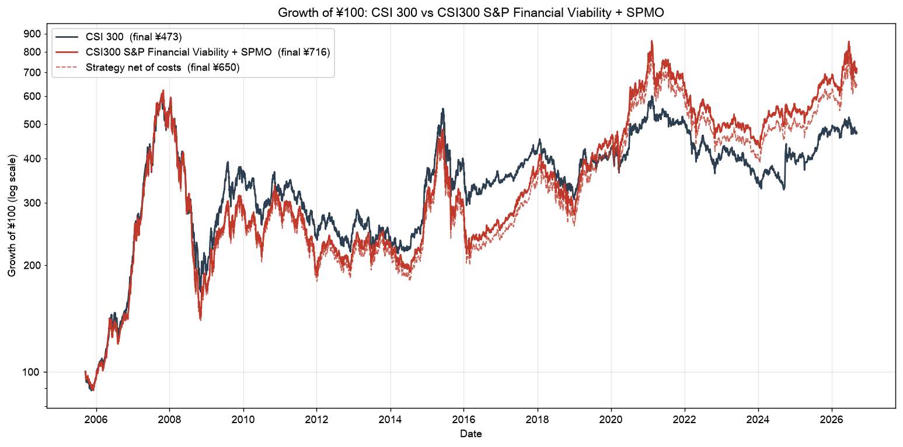

*图 1  ¥100 的增长（对数坐标）*


*图 2  月 K 线比较：本指数（上）与沪深300（下），对数坐标*

### 4.2 年度收益

|   年份 | 沪深300   | 策略（费前）   | 策略（费后）   | 超额（费前）   |
|-----:|:--------|:---------|:---------|:---------|
| 2005 | -4.6%   | -4.8%    | -4.8%    | -0.2%    |
| 2006 | +121.0% | +113.0%  | +111.7%  | -8.0%    |
| 2007 | +161.5% | +168.5%  | +166.5%  | +6.9%    |
| 2008 | -65.9%  | -69.0%   | -69.3%   | -3.1%    |
| 2009 | +96.7%  | +75.5%   | +74.3%   | -21.2%   |
| 2010 | -12.5%  | +0.8%    | +0.3%    | +13.3%   |
| 2011 | -25.0%  | -34.2%   | -34.5%   | -9.1%    |
| 2012 | +7.6%   | +16.5%   | +15.9%   | +9.0%    |
| 2013 | -7.6%   | +0.0%    | -0.3%    | +7.7%    |
| 2014 | +51.7%  | +37.3%   | +36.6%   | -14.4%   |
| 2015 | +5.6%   | -7.5%    | -7.9%    | -13.1%   |
| 2016 | -11.3%  | -12.9%   | -13.3%   | -1.6%    |
| 2017 | +21.8%  | +44.4%   | +44.0%   | +22.7%   |
| 2018 | -25.3%  | -22.3%   | -22.5%   | +3.1%    |
| 2019 | +36.1%  | +59.5%   | +58.9%   | +23.4%   |
| 2020 | +27.2%  | +60.2%   | +59.7%   | +33.0%   |
| 2021 | -5.2%   | -10.0%   | -10.3%   | -4.8%    |
| 2022 | -21.6%  | -27.0%   | -27.3%   | -5.4%    |
| 2023 | -11.4%  | -6.0%    | -6.4%    | +5.4%    |
| 2024 | +14.7%  | +26.4%   | +26.1%   | +11.7%   |
| 2025 | +17.7%  | +18.2%   | +17.8%   | +0.5%    |
| 2026 | -1.2%   | +6.5%    | +6.3%    | +7.8%    |

22 个日历年中策略跑赢 12 年。绝对收益最强：2007（+168.5%）, 2006（+113.0%）, 2009（+75.5%）；最弱：2008（-69.0%）, 2011（-34.2%）, 2022（-27.0%）。超额最大：2020（+33.0%）, 2019（+23.4%）, 2017（+22.7%）；超额最差：2009（-21.2%）, 2014（-14.4%）, 2015（-13.1%）。跑输的年份集中在两类环境：一是 2009、2014 年这类由低动量的金融、周期大盘股主导的急涨（动量反转），二是 2011、2015–2016 年长周期趋势中断后的震荡。

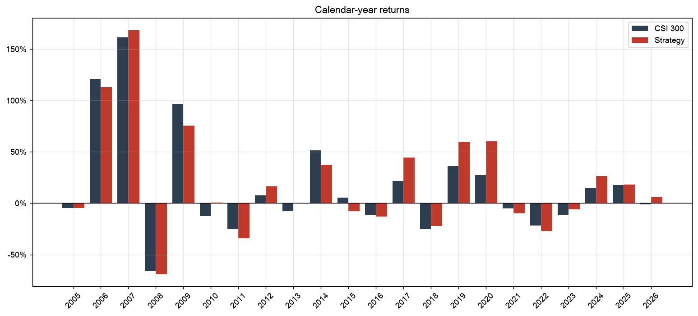

*图 3  年度收益：沪深300 vs 策略*

### 4.3 月度收益分布与上 / 下行捕获

| 指标      | 沪深300           | 策略              |
|:--------|:----------------|:----------------|
| 月均收益    | 0.92%           | 1.13%           |
| 月收益标准差  | 7.81%           | 8.30%           |
| 偏度      | 0.08            | -0.08           |
| 超额峭度    | 1.74            | 1.27            |
| 正收益月份占比 | 56%             | 56%             |
| 最佳月份    | 2007-04（+27.9%） | 2007-04（+24.7%） |
| 最差月份    | 2008-10（-25.9%） | 2008-08（-26.4%） |

月度超额收益（策略 − 沪深300）：均值 +0.21 个百分点，标准差 3.39 个百分点，为正的月份占 57%，t 统计量 0.97（253 个月）。最佳超额月 2020-12（+11.9%），最差超额月 2024-09（-13.9%）。上行月份捕获比 1.04、下行月份捕获比 0.96；上涨月跑赢概率 55%，下跌月跑赢概率 59%；按日收益估计的上行 β 0.95、下行 β 1.00。策略在涨跌两种月份中的平均超额相近（+0.22 vs +0.19 个百分点），没有明显的方向性择时特征，超额主要来自个股选择。

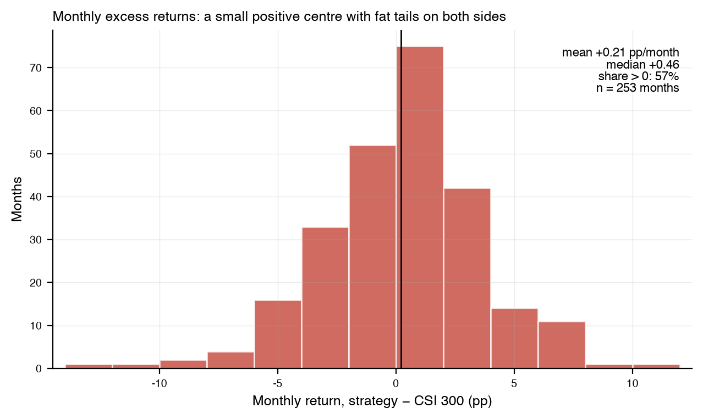

*图 4  月度超额收益分布*

### 4.4 回撤与尾部风险

| 指标   | 沪深300      | 策略         |
|:-----|:-----------|:-----------|
| 最大回撤 | -72.30%    | -77.16%    |
| 峰值日期 | 2007-10-16 | 2007-10-31 |
| 谷底日期 | 2008-11-04 | 2008-11-04 |
| 恢复日期 | 尚未恢复（价格指数） | 2020-07-13 |
| 下跌天数 | 385        | 370        |
| 恢复天数 | —          | 4269       |

| 系列       | 日均收益   | 日波动   |    偏度 |   超额峭度 | VaR 95%   | CVaR 95%   | VaR 99%   | CVaR 99%   | 最差单日   | 日期         | 最佳单日   |   单日 < −5% 天数 |   单日 > +5% 天数 |
|:---------|:-------|:------|------:|-------:|:----------|:-----------|:----------|:-----------|:-------|:-----------|:-------|--------------:|--------------:|
| CSI 300  | 0.04%  | 1.58% | -0.38 |   4.41 | -2.39%    | -3.96%     | -4.95%    | -6.41%     | -9.24% | 2007-02-27 | 9.34%  |            49 |            24 |
| Strategy | 0.05%  | 1.71% | -0.36 |   3.15 | -2.76%    | -4.24%     | -5.15%    | -6.57%     | -9.48% | 2007-02-27 | 8.62%  |            57 |            27 |

两个指数在 2007–2008 年都经历了 70% 以上的回撤，策略更深（-77.16% vs -72.30%）；策略价格指数于 2020-07-13 收复 2007 年高点，而沪深300价格指数至今未收复。日收益尾部（VaR / CVaR、极端日数量）策略略重于沪深300，与其更高的波动一致。相对强度（策略 / 沪深300）的最大回撤为 -33.2%，从 2007-08-09 持续跌到 2016-03-04，1260 天后于 2019-08-16 才收复——**连续八年半跑输**是持有这类策略必须接受的代价。

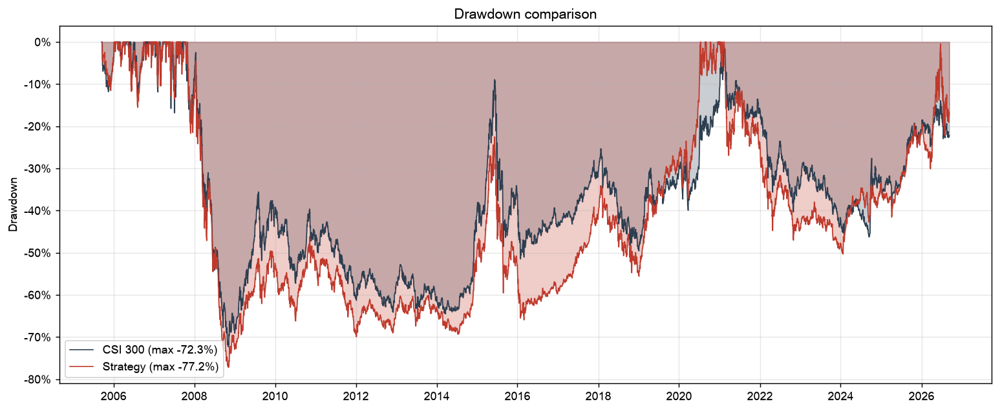

*图 5  回撤比较*

### 4.5 滚动指标

- 1 年滚动收益跑赢沪深300的比例 56.4%（中位数超额 +2.1%）；3 年滚动 CAGR 胜率 60.4%（中位数 +1.7%）；5 年滚动 CAGR 胜率 61.4%（中位数 +1.4%）。
- 1 年滚动 β 均值 0.98（0.45–1.41），滚动跟踪误差 5.6%–17.9%（均值 10.3%），滚动信息比率中位数 0.26。

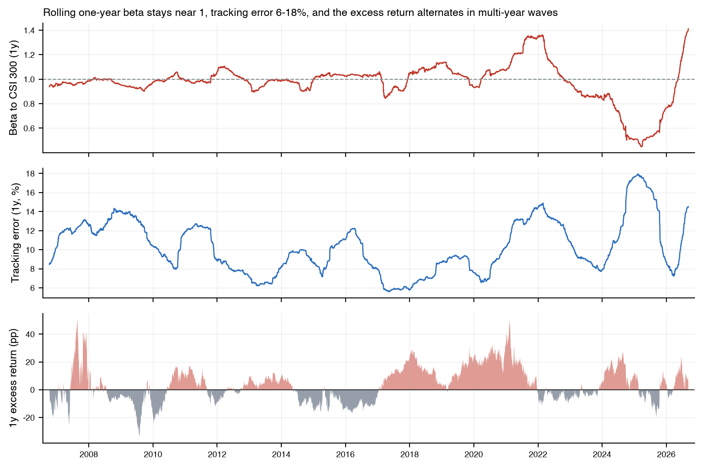

*图 6  滚动 1 年 β、跟踪误差与超额收益*

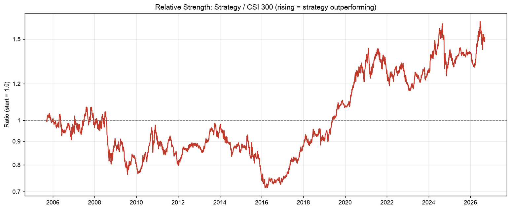

*图 7  相对强度：策略 / 沪深300*

### 4.6 市场周期分析

| 阶段          | 起          | 止          | 沪深300收益   | 策略收益   | 超额     | 沪深300 CAGR   | 策略 CAGR   | 沪深300波动   | 策略波动   |   沪深300 Sharpe |   策略 Sharpe | 沪深300最大回撤   | 策略最大回撤   |
|:------------|:-----------|:-----------|:----------|:-------|:-------|:-------------|:----------|:----------|:-------|---------------:|------------:|:------------|:---------|
| 2005-2007   | 2005-09-16 | 2007-12-28 | 451.8%    | 444.7% | -7.1%  | 111.5%       | 110.3%    | 28.5%     | 29.8%  |           2.79 |        2.66 | -20.9%      | -21.7%   |
| 2008        | 2008-01-02 | 2008-12-31 | -66.2%    | -69.0% | -2.8%  | -66.4%       | -69.2%    | 47.8%     | 47.5%  |          -2.02 |       -2.21 | -71.6%      | -76.1%   |
| 2009-2014   | 2009-01-05 | 2014-12-31 | 87.7%     | 82.2%  | -5.5%  | 11.1%        | 10.5%     | 23.5%     | 25.0%  |           0.57 |        0.53 | -44.9%      | -44.2%   |
| 2015-2016   | 2015-01-05 | 2016-12-30 | -9.1%     | -22.0% | -12.9% | -4.7%        | -11.8%    | 31.4%     | 33.7%  |           0.01 |       -0.20 | -46.7%      | -56.0%   |
| 2017-2018   | 2017-01-03 | 2018-12-28 | -9.9%     | 11.3%  | +21.2% | -5.1%        | 5.5%      | 16.5%     | 19.8%  |          -0.23 |        0.37 | -31.9%      | -31.4%   |
| 2019-2020   | 2019-01-02 | 2020-12-31 | 75.5%     | 159.5% | +84.0% | 32.5%        | 61.2%     | 21.0%     | 23.1%  |           1.45 |        2.19 | -16.1%      | -17.8%   |
| 2021-2024   | 2021-01-04 | 2024-12-31 | -25.3%    | -23.0% | +2.3%  | -7.1%        | -6.3%     | 18.4%     | 21.0%  |          -0.31 |       -0.21 | -45.6%      | -50.3%   |
| 2025-latest | 2025-01-02 | 2026-09-09 | 19.7%     | 28.8%  | +9.1%  | 11.3%        | 16.2%     | 16.6%     | 23.3%  |           0.73 |        0.76 | -10.5%      | -21.8%   |

策略跑赢的阶段：2017-2018、2019-2020、2021-2024、2025-latest；跑输的阶段：2005-2007、2008、2009-2014、2015-2016。规律与动量文献一致：**趋势延续、龙头持续领涨的结构性行情**（2017–2018 年的核心资产、2019–2020 年的消费 / 新能源 / 医药成长股）对策略最有利；**由估值修复和政策刺激触发的 V 型反转**（2009 年上半年、2014 年四季度、2024 年 9 月）以及**趋势反复的震荡市**（2011–2013、2015–2016）最不利。2005–2007 年大牛市中策略与指数几乎同步（那一轮领涨的正是权重最大的金融与周期股）。

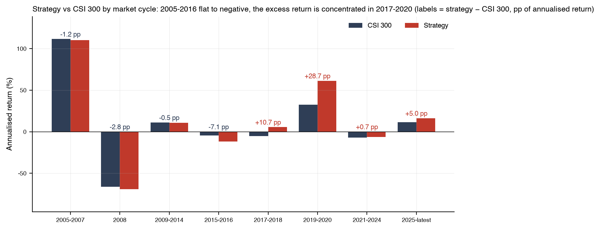

*图 8  各市场阶段的年化收益*

### 4.7 动量崩塌

| 结束日        | 开始日        | 策略 3 个月   | 沪深300 3 个月   | 相对     |
|:-----------|:-----------|:----------|:-------------|:-------|
| 2024-12-03 | 2024-08-27 | -3.1%     | +19.6%       | -22.7% |
| 2009-07-31 | 2009-04-30 | +21.8%    | +42.4%       | -20.6% |
| 2008-10-20 | 2008-07-15 | -48.8%    | -33.5%       | -15.3% |
| 2022-02-11 | 2021-11-08 | -17.8%    | -5.1%        | -12.7% |
| 2023-01-30 | 2022-10-25 | +3.8%     | +15.8%       | -12.0% |

5 次最大的三个月相对回撤中，3 次发生在**市场上涨**而非下跌中（2024-12、2009-07、2023-01），其余发生在 2008-10、2022-02 的下跌中。上涨中的崩塌符合 Daniel & Moskowitz（2016）的刻画：在高波动的熊市底部反弹时，此前被抛弃的低动量股票反弹最猛，而动量组合恰好低配它们。2024-08-27 → 2024-12-03 的一次相对 -22.7%，是全样本最大的一次崩塌：2024 年 9 月 24 日一揽子政策出台后，沪深300三个月上涨 19.6%，而 3 月和 9 月两次调仓所持的高动量股（以周期资源、电子为主）合计 -3.1%。半年一次的调仓频率意味着策略只能在 2025 年 3 月才转向。

## 5. 组合特征

### 5.1 Financial Viability 筛选漏斗

每个参考日 300 只成分股中平均 37 只（19–76 只）未通过财务资格，通过者 263 只（224–281）。不合格原因合计：

| 不合格原因                |   股票·期次数 | 占比    |
|:---------------------|---------:|:------|
| 无财务报表（多为已退市公司）       |      535 | 34.1% |
| 最近一季 ≤ 0 且最近四季合计 ≤ 0 |      379 | 24.1% |
| 仅最近一季 ≤ 0            |      321 | 20.4% |
| 仅最近四季合计 ≤ 0          |      279 | 17.8% |
| 仅 3 个连续季度已公布         |       31 | 2.0%  |
| 仅 2 个连续季度已公布         |       12 | 0.8%  |
| 仅 1 个季度已公布           |        8 | 0.5%  |
| 参考日前无任何已公布报表         |        5 | 0.3%  |

动量数据不足（新上市或长期停牌，窗口内交易日 < 150）平均每期再剔除 6.3 只。Z 分数被 ±3 截断的股票平均每期 2.6 只；入选门槛 Momentum Score 的中位数为 1.60（即 Z ≈ +0.60），最高分中位数 4.00。

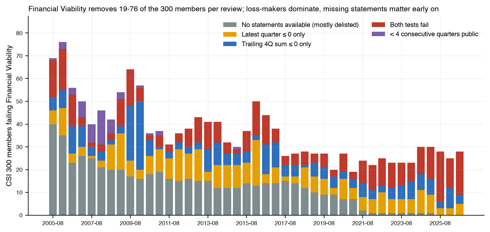

*图 9  各参考日未通过 Financial Viability 的成分股数量及原因*

### 5.2 成分数量、集中度与权重上限

- 成分股数量 45–55 只（均值 51.3）；有效成分数（1/Σw²）19–37（均值 25.3），即权重集中度大约相当于一个 25 只等权组合。
- 前十大权重合计均值 53%（38%–65%）；最大单一权重均值 8.9%，9% 上限平均每期约束 1.9 只。
- 策略持有的股票合计占沪深300（代理）市值的 24%（11%–42%）；策略权重落在沪深300市值前 100 名股票上的比例均值 81%，即策略整体上仍是一个大盘股组合，但相对母指数明显向中等市值倾斜。
- 入选股票 Momentum Score 均值 2.50，最低入选分数均值 1.62。

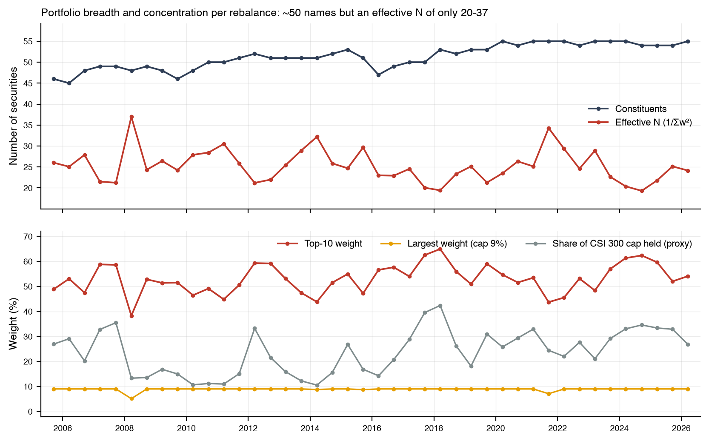

*图 10  每次调仓的成分数量、有效成分数与集中度*

### 5.3 成分持续性与换手

42 次已实施调仓共出现过 547 只不同的成分股。相邻两期成分股的平均保留率 45%；一段连续成员期的平均长度 1.8 期（中位数 1 期），51% 的成员期只持续一次调仓——动量组合的"短记忆"特征。入选次数最多的股票：贵州茅台（20 次）、五粮液（17 次）、恒瑞医药（16 次）、泸州老窖（15 次）、山东黄金（15 次）、同仁堂（14 次）、招商银行（14 次）、三一重工（14 次）、福耀玻璃（14 次）、格力电器（14 次）。

单边换手每次调仓平均 55.1%（最高 82.8%），折合每年 107.7%，与 S&P 500 Momentum 公布的换手水平相当。

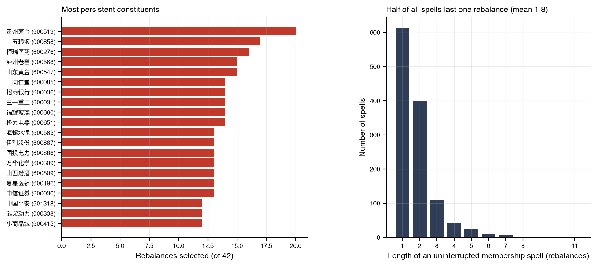

*图 11  成分股持续性*

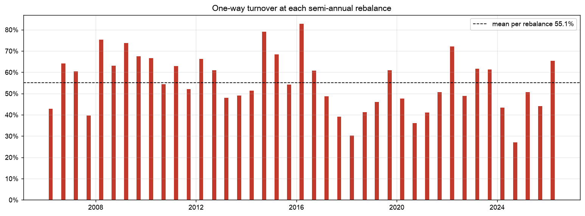

*图 12  每次调仓的单边换手率*

### 5.4 行业暴露（当前）

历史行业分类没有免费的点位数据，此处只用中证沪深300一级行业指数的**当前**成分对**最新两期**名单分类：

| 中证一级行业   | CSI 300 (2026-08-31)   | Strategy 2026-03-20   | Strategy 2026-09-18 (pending)   |
|:---------|:-----------------------|:----------------------|:--------------------------------|
| 信息技术     | 22.6%                  | 30.2%                 | 45.3%                           |
| 金融       | 19.9%                  | 13.5%                 | 0.0%                            |
| 工业       | 16.2%                  | 8.5%                  | 15.0%                           |
| 通信服务     | 9.9%                   | 13.8%                 | 16.7%                           |
| 原材料      | 9.6%                   | 32.7%                 | 15.9%                           |
| 主要消费     | 6.4%                   | 0.0%                  | 0.0%                            |
| 可选消费     | 5.4%                   | 0.0%                  | 3.4%                            |
| 医药卫生     | 4.3%                   | 1.3%                  | 2.0%                            |
| 公用事业     | 2.8%                   | 0.0%                  | 0.0%                            |
| 能源       | 2.7%                   | 0.0%                  | 1.8%                            |
| 房地产      | 0.3%                   | 0.0%                  | 0.0%                            |

相对沪深300，最新已实施名单最高配 原材料（+23.1 个百分点）和 信息技术（+7.6），最低配 工业（-7.7）和 主要消费（-6.4）。SPMO 类规则不做行业中性，行业暴露随动量所在板块大幅摆动，这是其超额收益与跟踪误差的共同来源。

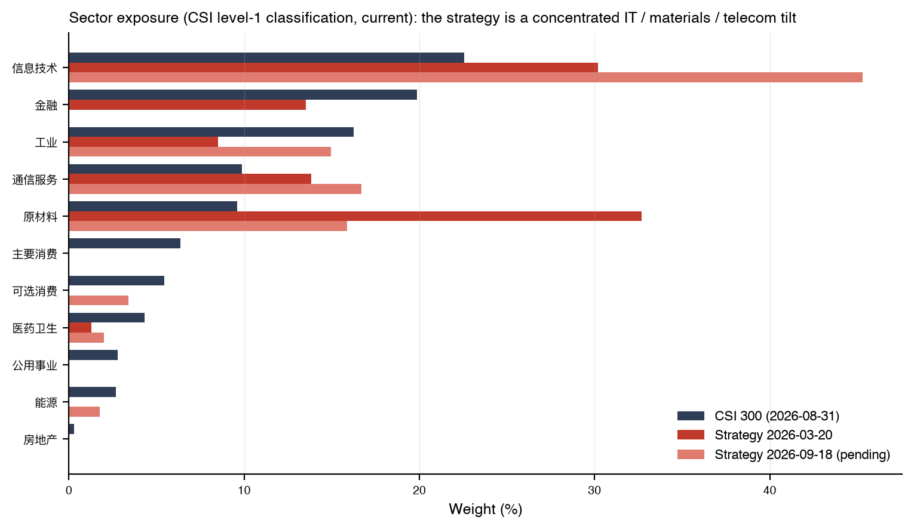

*图 13  行业暴露：沪深300 vs 最新两期名单*

### 5.5 最新持仓

2026-03-20 实施（参考日 2026-02-27）的前 15 大权重股，共 55 只：

|     代码 | 名称   |   Momentum Score |   排名 | 沪深300权重（代理）   | 最终权重   | 触及上限   |
|-------:|:-----|-----------------:|-----:|:--------------|:-------|:-------|
| 601138 | 工业富联 |             3.03 |   13 | 2.12%         | 9.00%  | 是      |
| 601288 | 农业银行 |             1.79 |   48 | 3.92%         | 9.00%  | 是      |
| 601899 | 紫金矿业 |             3.73 |    7 | 1.56%         | 8.71%  |        |
| 300308 | 中际旭创 |             4.00 |    1 | 1.13%         | 6.76%  |        |
| 603993 | 洛阳钼业 |             4.00 |    3 | 0.80%         | 4.80%  |        |
| 300502 | 新易盛  |             4.00 |    5 | 0.61%         | 3.65%  |        |
| 688041 | 海光信息 |             1.99 |   42 | 1.16%         | 3.46%  |        |
| 300476 | 胜宏科技 |             4.00 |    4 | 0.50%         | 2.98%  |        |
| 601318 | 中国平安 |             1.52 |   61 | 1.29%         | 2.92%  |        |
| 688256 | 寒武纪  |             2.01 |   41 | 0.95%         | 2.84%  |        |
| 002371 | 北方华创 |             2.21 |   32 | 0.66%         | 2.16%  |        |
| 300394 | 天孚通信 |             2.42 |   26 | 0.55%         | 1.98%  |        |
| 600111 | 北方稀土 |             2.93 |   16 | 0.43%         | 1.89%  |        |
| 000792 | 盐湖股份 |             3.11 |   10 | 0.39%         | 1.80%  |        |
| 688008 | 澜起科技 |             3.01 |   14 | 0.36%         | 1.61%  |        |

参考日 2026-08-31 已计算、将于 2026-09-18 收盘后实施的名单（共 54 只，未进入回测）前 15 名：

|     代码 | 名称   |   Momentum Score |   排名 | 目标权重   |
|-------:|:-----|-----------------:|-----:|:-------|
| 300308 | 中际旭创 |             4.00 |    2 | 9.00%  |
| 300750 | 宁德时代 |             2.03 |   40 | 8.49%  |
| 601138 | 工业富联 |             1.78 |   50 | 6.20%  |
| 688256 | 寒武纪  |             2.49 |   20 | 4.72%  |
| 601899 | 紫金矿业 |             2.29 |   28 | 4.29%  |
| 300502 | 新易盛  |             3.08 |   12 | 4.20%  |
| 002371 | 北方华创 |             2.84 |   14 | 3.90%  |
| 688041 | 海光信息 |             2.20 |   30 | 3.52%  |
| 000333 | 美的集团 |             2.08 |   37 | 3.40%  |
| 688012 | 中微公司 |             3.19 |   11 | 2.95%  |
| 600183 | 生益科技 |             2.82 |   15 | 2.83%  |
| 603986 | 兆易创新 |             3.53 |    8 | 2.60%  |
| 603993 | 洛阳钼业 |             2.74 |   17 | 2.47%  |
| 002384 | 东山精密 |             3.22 |   10 | 2.40%  |
| 300408 | 三环集团 |             3.96 |    4 | 2.30%  |

## 6. 收益来源分解：选股还是加权？

用同一指数引擎、同样的调仓日期与成分股名单，只改变权重方案，可以把策略相对母指数的超额拆开（全部为价格指数、费前）：

| 组合                           | ¥100 终值   | CAGR   | 含义                              |
|:-----------------------------|:----------|:-------|:--------------------------------|
| 沪深300（官方）                    | ¥472.6    | 7.68%  |                                 |
| 沪深300复制（全部成分股，本项目权重代理，同日期调仓） | ¥381.5    | 6.59%  | 权重代理相对官方指数的偏差                   |
| 入选成分股，按自由流通市值（代理）加权          | ¥697.4    | 9.70%  | 选股效应（vs 复制指数）                   |
| 入选成分股，SPMO 加权（本指数）           | ¥715.6    | 9.83%  | Momentum Score 倾斜 + 上限（vs 市值加权） |
| 入选成分股，等权                     | ¥762.9    | 10.17% | 参照：完全去除市值倾斜                     |

- **选股效应**（同一权重口径下，前 20% 动量股 vs 全部 300 只）：+3.11 个百分点/年，是超额收益的主体。
- **Momentum Score 加权倾斜**（vs 同一篮子市值加权）：+0.13 个百分点/年——SPMO 式加权在 A 股历史上带来的增益有限。
- **等权 vs 市值加权**：+0.47 个百分点/年，说明在入选篮子内部，市值越大的股票（多为国有大盘股）动量延续性越差。
- **权重代理偏差**：-1.09 个百分点/年。本项目的自由流通代理高配国有大盘股，用它复制沪深300会跑输官方指数；策略权重同样受此影响，因此上表中的策略 CAGR 相对官方沪深300的 +2.15 个百分点超额，很可能低于真实自由流通加权版本能取得的水平。

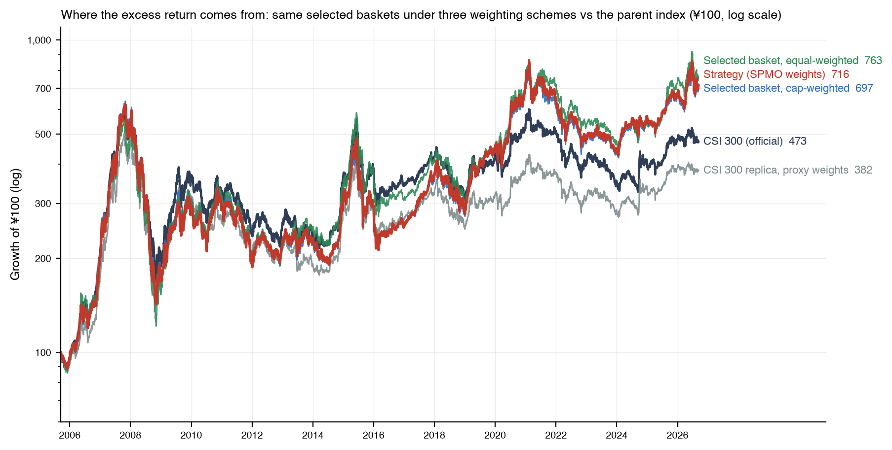

*图 14  同一批成分股在不同权重方案下的表现，以及权重代理复制的沪深300*

## 7. 交易成本与可实施性

费后指数按当期实际制度扣费：佣金随历史下调、印花税按各时期税率（2008 年 9 月起仅卖出征收、2023 年 8 月起减半）、过户费与固定冲击成本。结果：费前 CAGR 9.83%，费后 9.33%，年化成本拖累 0.50%；21 年累计支付的成本相当于期末净值的 9.9%。

|   年份 | 单边换手   |   年份  | 单边换手    |
|-----:|:-------|------:|:--------|
| 2006 | 107%   |  2017 | 88%     |
| 2007 | 100%   |  2018 | 72%     |
| 2008 | 138%   |  2019 | 107%    |
| 2009 | 141%   |  2020 | 84%     |
| 2010 | 121%   |  2021 | 92%     |
| 2011 | 115%   |  2022 | 121%    |
| 2012 | 127%   |  2023 | 123%    |
| 2013 | 97%    |  2024 | 71%     |
| 2014 | 130%   |  2025 | 95%     |
| 2015 | 123%   |  2026 | 65%     |
| 2016 | 144%   |       |         |

可实施性方面：成分股全部为沪深300成分，流动性充足；半年一次调仓、单边换手约 55%，对规模不敏感；主要摩擦来自停牌股票（回测中按停牌前价格成交）以及涨跌停板日无法足量成交。费后指数已把这些成本按保守假设纳入，但未对超大规模资金的冲击成本设上限。

## 8. 与 GitHub 项目 HSI300-Momentum-Strategy 的对比

[HSI300-Momentum-Strategy](https://github.com/dongzhaohe321418-lab/HSI300-Momentum-Strategy) 同样受 SPMO 启发，在沪深300内做动量选股，但设计取向不同：它是一个**集中持股的量化组合**（Top-20 等权、季度调仓、行业上限），而本项目是一只**指数**（约 50 只、市值 × 分数加权、半年调仓、缓冲与上限）。下面先比较规则，再用本项目的数据复现其规则，在相同窗口和相同数据上比较结果。

### 8.1 规则差异

| 项目       | HSI300-Momentum-Strategy                                 | 本项目                                                     |
|:---------|:---------------------------------------------------------|:--------------------------------------------------------|
| 数据源      | BaoStock：每月末查询 hs300 成分快照（2013 起）、后复权收盘价、当前行业分类          | 中证公告逐日点位成分（2005 起）、新浪 / 东财原始价格自建复权、季度财报与公告日             |
| 成分股口径    | 调仓日采用最近一个月末快照                                            | 调仓日当日有效成分；调仓期间被剔除的持仓同日剔除                                |
| 盈利筛选     | 无                                                        | S&P Financial Viability（最近一季与最近四季持续经营净利润 > 0）           |
| 动量信号     | P(t−22)/P(t−253) − 1 除以 252 日日收益标准差（窗口含最近一月），T−1 计算 T 交易 | 12–1 月价格变动除以同窗口日收益标准差；参考日计算，三周后实施                       |
| 标准化 / 分数 | 无（直接按原始风险调整动量排序）                                         | 横截面 Z 分数（±3 截断）→ Momentum Score                         |
| 选样       | Top 20，每个（当前）行业最多 5 只                                    | 合格股票前 20%（约 45–55 只），S&P 20% 缓冲，母指数资格优先                 |
| 权重       | 等权                                                       | 自由流通市值 × Score，公司上限 min(9%, 20× 母指数权重)                  |
| 调仓频率     | 季度（自然季末最后一个交易日收盘）                                        | 半年（2 / 8 月末参考，3 / 9 月第三个星期五实施）                          |
| 收益口径     | 策略用后复权价（含股息）vs 沪深300价格指数                                 | 价格指数与全收益指数分别对应比较                                        |
| 成本       | 成交金额的 15bp（买卖同费率）                                        | 按历史制度的佣金 + 印花税 + 过户费 + 冲击成本（2005–2008 年印花税单边 0.1%–0.3%） |
| 回测区间     | 2019-01-01 → 2025-12-20（7 年）                             | 2005-09-16 → 2026-09-09（21 年）                           |
| 资格审计     | 无                                                        | 每期自动审计成员资格、财报公告日、动量数据可得性，违反即报错                          |

### 8.2 其公布结果 vs 在本项目数据上的复现（2019-01-02 → 2025-12-19）

我们按其代码逐条复现规则（信号、季末调仓、等权、漂移、15bp 成本），只把数据换成本项目的点位成分与复权价格。行业上限使用当前中证一级行业分类（其代码同样使用当前分类），历史上已不在沪深300的股票无分类，归入"未知"一类同样受 5 只上限约束。

| 系列                         | 累计收益   | 年化收益   | 年化波动   |   夏普(rf=2%) | 最大回撤   |
|:---------------------------|:-------|:-------|:-------|------------:|:-------|
| HSMO 仓库公布值（策略）             | 283.6% | 22.2%  | 24.4%  |        0.83 | -33.5% |
| HSMO 仓库公布值（沪深300）          | 53.8%  | 6.6%   | 19.1%  |        0.24 | -45.6% |
| HSMO 规则复现（行业上限 5 只，当前行业分类） | 235.7% | 19.8%  | 24.4%  |        0.73 | -39.7% |
| HSMO 规则复现（无行业上限）           | 221.2% | 19.0%  | 24.7%  |        0.69 | -41.0% |
| HSMO 规则复现（无行业上限，本项目成本模型）   | 218.9% | 18.9%  | 24.7%  |        0.68 | -41.1% |
| 本指数：全收益，费前                 | 182.0% | 16.7%  | 21.2%  |        0.69 | -46.4% |
| 本指数：全收益，费后                 | 175.3% | 16.3%  | 21.2%  |        0.68 | -47.0% |
| 本指数：价格，费前                  | 135.8% | 13.6%  | 21.2%  |        0.55 | -50.3% |
| 沪深300（价格）                  | 53.8%  | 6.6%   | 19.1%  |        0.24 | -45.6% |
| 沪深300（全收益）                 | 81.8%  | 9.3%   | 19.1%  |        0.38 | -41.6% |

|   年份 | HSMO 公布：策略   | HSMO 公布：沪深300   | 复现：HSMO 规则（行业上限）   | 复现：HSMO 规则（无上限）   | 本指数（全收益，费后）   | 沪深300（价格，本项目数据）   |
|-----:|:-------------|:----------------|:-------------------|:------------------|:--------------|:------------------|
| 2019 | 40.9%        | 38.0%           | 43.7%              | 43.2%             | 63.8%         | 38.0%             |
| 2020 | 85.9%        | 27.2%           | 70.8%              | 71.3%             | 61.4%         | 27.2%             |
| 2021 | 11.1%        | -5.2%           | 9.5%               | 7.0%              | -9.7%         | -5.2%             |
| 2022 | -8.7%        | -21.6%          | -14.3%             | -13.9%            | -25.3%        | -21.6%            |
| 2023 | -6.5%        | -11.4%          | -8.8%              | -7.0%             | -2.4%         | -11.4%            |
| 2024 | 30.8%        | 14.7%           | 30.8%              | 30.4%             | 31.7%         | 14.7%             |
| 2025 | 17.8%        | 16.1%           | 22.2%              | 17.2%             | 20.2%         | 16.1%             |

复现结果与其公布值方向一致、量级接近：沪深300年度收益逐年完全相同（两边都用官方价格指数），策略年化 19.8% vs 公布 22.2%，差异主要来自 2020 年（复现 70.8% vs 公布 85.9%）和 2022 年，源于成分股快照口径（月末快照 vs 逐日）、复权价格与行业分类的差别，而非规则本身。因此可以把两条曲线放在同一数据上比较：2019–2025 年 HSMO 规则 ¥100 → ¥321（无行业上限，15bp）/ ¥336（行业上限），本指数全收益费后 ¥275，沪深300全收益 ¥182。HSMO 规则在这 7 年里收益更高，最大回撤更小（-41.0% vs 本指数全收益 -47.0%）——差别主要在 2021–2022 年：季度调仓的等权组合在 2021 年 2 月核心资产见顶后一个季度内就转向，而半年调仓的本指数持有 2 月底确定的名单直到 9 月。

### 8.3 全样本、同数据比较（2005-09-16 → 2026-09-09）

| 系列                       | 累计收益    | 年化收益   | 年化波动   |   夏普(rf=2%) | 最大回撤   |
|:-------------------------|:--------|:-------|:-------|------------:|:-------|
| HSMO 规则复现（无行业上限，15bp）    | 1114.8% | 13.1%  | 28.9%  |        0.39 | -73.7% |
| HSMO 规则复现（无行业上限，本项目成本模型） | 1047.6% | 12.8%  | 28.9%  |        0.37 | -73.9% |
| HSMO 规则复现（行业上限，当前行业分类）   | 2122.3% | 16.6%  | 28.1%  |        0.52 | -71.0% |
| 本指数：全收益，费后               | 855.1%  | 11.8%  | 27.1%  |        0.36 | -77.2% |
| 本指数：全收益，费前               | 951.8%  | 12.3%  | 27.1%  |        0.38 | -77.0% |
| 本指数：价格，费前                | 615.6%  | 10.2%  | 27.1%  |        0.30 | -77.2% |
| 沪深300（价格）                | 372.6%  | 8.0%   | 25.1%  |        0.24 | -72.3% |
| 沪深300（全收益）               | 600.1%  | 10.1%  | 25.1%  |        0.32 | -72.0% |

把窗口拉长到 21 年（三种成本假设见表），HSMO 规则（无行业上限）¥100 → ¥1,215，本指数全收益费后 ¥952，沪深300全收益 ¥700。HSMO 规则的年化收益仍高出本指数约 1.3 个百分点，但代价是：

- **集中度**：20 只等权 vs 约 50 只，有效成分数 20 vs 25；年化波动 28.9% vs 27.1%。
- **换手**：季度调仓、无缓冲，双边换手平均每季 109%，折合单边约 218%/年，是本指数（108%/年）的 2.0 倍；换用本项目的历史成本模型后其年化降至 12.8%（2019–2025 窗口 18.9%）。
- **行业中性规则不稳定**：按当前行业分类施加"每行业 5 只"在全样本上把年化从 13.1% 推高到 16.6%，其中 2006 年一年相差 +51 个百分点——差异来自把早年已退市 / 已调出的股票统统归入"未知"行业并受同一上限约束，这是**当前分类倒推历史**带来的伪影，不能视为该规则的真实增益。
- **回撤**：2008 年两者都亏损约 70%（HSMO 规则 -73.7%，2008-01-15 → 2008-11-04），HSMO 于 2015-04-17 收复，本指数全收益于 2020-06-18 收复。
- **样本期**：该项目公布的 2019–2025 年恰好避开了 2008–2016 年动量策略在 A 股长期跑输的阶段（见 §4.6），7 年样本的年化超额（15.6%）不应外推为长期预期。
- **口径**：其策略曲线含股息（后复权）而基准为价格指数，7 年内约多计 2 个百分点/年的股息；本报告分别给出价格与全收益口径。

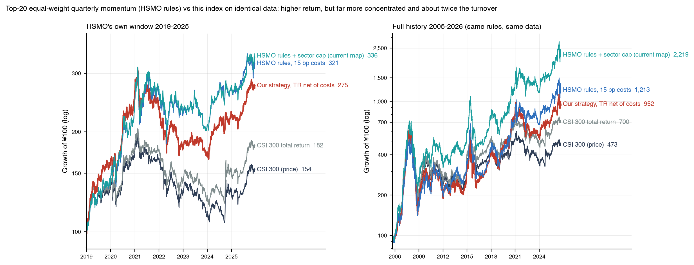

*图 15  HSMO 规则（在本项目数据上复现）与本指数：2019–2025 窗口与 2005–2026 全样本*

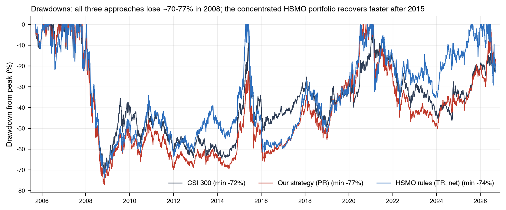

*图 16  回撤比较：沪深300、本指数、HSMO 规则*

### 8.4 评述

两种设计代表了动量因子的两种用法。HSI300-Momentum-Strategy 是**高活跃度的因子组合**：更集中、更快的调仓让它在趋势切换后能更早转向，历史收益更高，但波动、换手、成本和单一行业 / 个股风险也更高，且其点位数据（月末快照、当前行业分类）与成本假设（15bp）在 2005–2008 年的制度环境下偏乐观。本项目是**可指数化的规则**：更宽的成分、市值倾斜的权重、缓冲和上限带来更低的换手和更接近母指数的风险特征（β≈1、跟踪误差约 10%），代价是对趋势反转反应更慢（2021 年、2024 年 9 月）。两者在同一数据上都长期战胜沪深300，也都在 2008、2011、2015–2016 年经历长时间跑输——**动量在 A 股大盘股中的有效性是周期性的**，任何以 2019 年以后的样本为依据的收益预期都需要打折。

## 9. 结论：对 17 个问题的回答

1. **回测起止日期**：2005-09-16 → 2026-09-09（首个参考日 2005-08-31，首次实施 2005-09-16；22 个日历年（含首尾不完整年份））。
2. **¥100 投资沪深300**：¥472.6（价格指数）；含股息 ¥700.1。
3. **¥100 投资策略**：¥715.6（费前）/ ¥649.8（费后）；全收益费前 ¥1,051.8。
4. **CAGR**：沪深300 7.68%，策略 9.83%（全收益口径 9.72% vs 11.87%）。
5. **年化超额收益**：2.15%（费后 1.65%）；Jensen α 2.62%，β 0.99。
6. **最大回撤**：沪深300 -72.30%（2007-10-16 → 2008-11-04）；策略 -77.16%（2007-10-31 → 2008-11-04）。
7. **Sharpe**：沪深300 0.43，策略 0.49（费后 0.47）。
8. **年化波动率**：沪深300 24.69%，策略 26.71%。
9. **平均换手率**：单边每次调仓 55.1%，每年 107.7%（最高单次 82.8%）。
10. **费后 CAGR**：9.33%（成本拖累 0.50%/年）。
11. **最强年份**：2007（+168.5%）、2006（+113.0%）、2009（+75.5%）；超额最大：2020（+33.0%）、2019（+23.4%）、2017（+22.7%）。
12. **最差年份**：2008（-69.0%）、2011（-34.2%）、2022（-27.0%）；超额最差：2009（-21.2%）、2014（-14.4%）、2015（-13.1%）。
13. **最大动量崩塌**：2024-08-27 → 2024-12-03，策略 -3.1% vs 沪深300 +19.6%（相对 -22.7%）。
14. **是否长期稳定跑赢**：长期跑赢但不稳定——22 年中 12 年跑赢，2005–2016 年累计跑输且相对强度回撤 -33.2%、历时 3130 天，超额几乎全部来自 2017 年以后；月度超额的 t 统计量 0.97，统计上不显著。
15. **滚动超额胜率**：3 年 60.4%，5 年 61.4%（1 年 56.4%）。
16. **相对强度趋势**：由 1.00 升至 1.51（年化 +2.00%），但先经历 2007–2016 年的长期下行（-33.2%），2017 年后转为上行并于 2019 年收复。
17. **Financial Viability + SPMO 是否显著改善沪深300的长期复利与风险调整收益**：长期复利有实质改善（CAGR 7.68% → 9.83%，费后 9.33%；21 年终值高 51%），风险调整收益温和改善（Sharpe 0.43 → 0.49，Sortino 0.59 → 0.68，信息比率 0.20），但波动和最大回撤更大、超额收益集中在少数年份且统计上不显著。结论：**有改善，但不能称为"显著"；它是一条长期期望为正、需要忍受多年跑输的规则**。

## 10. 附录

### 10.1 复现方法

```bash
pip install -r requirements.txt
python main.py                      # 数据（缓存）→ 股票池 → 评分 → 回测 → 图表 → 报告
python scripts/generate_research_report.py   # 本研究报告（含归因、HSMO 复现、DOCX）
python -m pytest tests               # 19 个单元测试
```

### 10.2 主要输出文件

| 文件                                                                                                                                        | 内容                                                                           |
|:------------------------------------------------------------------------------------------------------------------------------------------|:-----------------------------------------------------------------------------|
| output/scores/YYYY-MM-DD.csv                                                                                                              | 每个参考日全部沪深300成分股的资格、动量、Z 分数、Momentum Score、排名、权重                              |
| output/holdings/YYYY-MM-DD.csv                                                                                                            | 每次实施的成分股与权重（`_pending` 为尚未实施）                                                |
| output/performance/index_levels.csv                                                                                                       | 日频指数点位：沪深300、策略（费前 / 费后）、全收益版本（起点 100；`index_levels_base1000.csv` 为 1000 起点） |
| output/performance/strategy_ohlc.csv / csi300_ohlc.csv                                                                                    | 日 OHLC（策略 Volume 留空）                                                         |
| output/performance/summary.csv, annual_returns.csv, market_cycles.csv, momentum_crashes.csv, rebalance_summary.csv, eligibility_audit.csv | 统计与审计                                                                        |
| output/research/*.csv                                                                                                                     | 本报告的归因、HSMO 复现、集中度、漏斗、持续性、行业暴露等分析表                                           |
| output/charts/*.png, output/charts/research/*.png                                                                                         | 全部图表                                                                         |
| data/processed/csi300_membership_intervals.csv                                                                                            | 点位成分股区间表（949 只证券）                                                            |

### 10.3 参数表（config.yaml，未做任何收益导向调整）

| 参数                  | 取值                                                                               |
|:--------------------|:---------------------------------------------------------------------------------|
| Financial Viability | 最近一季 > 0 且最近四季合计 > 0；字段 CONTINUED_NETPROFIT → NETPROFIT；公告日 ≤ 参考日；不合理公告日 → 法定截止日 |
| 动量窗口                | 参考日前 13 个月 → 前 1 个月；最少 150 个交易日                                                  |
| Z 分数截断              | ±3                                                                               |
| 选样比例                | 合格股票的 20%（四舍五入）                                                                  |
| 缓冲                  | 前 80% 自动入选；现成分股 120% 以内保留                                                        |
| 权重上限                | min(9%, 20 × 母指数权重)；无可行解时倍数逐步 +1（本次运行未触发）                                        |
| 调仓                  | 2 / 8 月最后一个交易日参考；3 / 9 月第三个星期五收盘后实施                                              |
| 成本                  | 佣金 / 印花税 / 过户费按历史制度；冲击成本固定 0.10% 每边                                              |
| 指数基点                | 1000（Growth-of-¥100 序列另按 100 重设）                                                 |

*本报告仅为历史回测研究，不构成投资建议。历史表现不代表未来收益。*